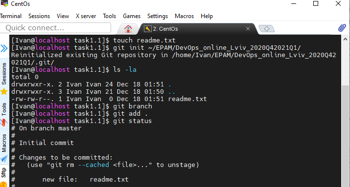
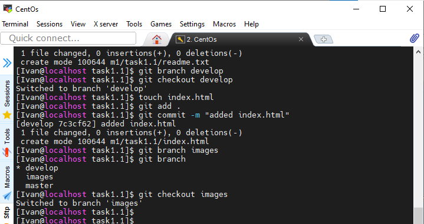
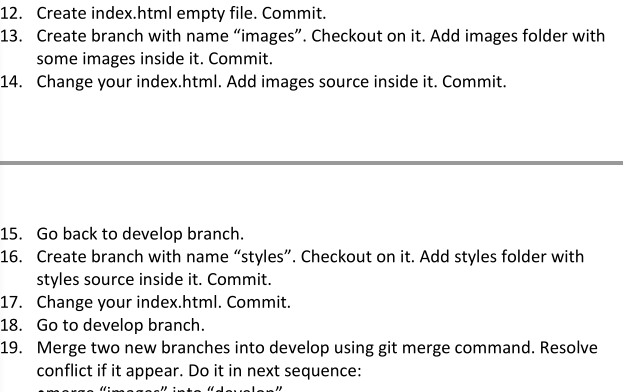

##### DevOps_online_Lviv_2020Q42021Q1
# Task1.1
___
### Git

In this task, I tested the basic commands and methods of Git and GitHub. Several 
branches were created, varius action with files and folders were performed. The 
following commands were used in the process of performing the task:

- *git clone*;
- *git add*;
- *git commit*;
- *git status*;
- *git log*;
- *git branch*;
- *git checkout*;
- *git merge*;
- *git pull*;
- *git reflog*/

The results of the task were transferred to a remote repository on GitHub.

 

I apologize for the errors in the image files names.
___

### DevOps

I can say, DevOps is a kind of culture of behavior, when everyone tries to do 
everything to solve the problem or eliminate shortcomings. In production, the 
Devops engineer occupies an intermediate place between developers and production.
In my opinion, Devops-engineer must first understand the processes occurring in the
development-production cycle, be able to quickly find ways to solve new problems.
