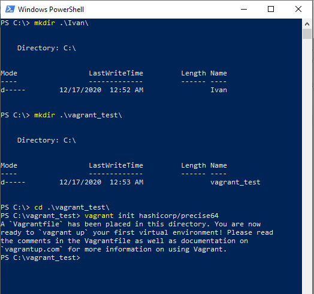
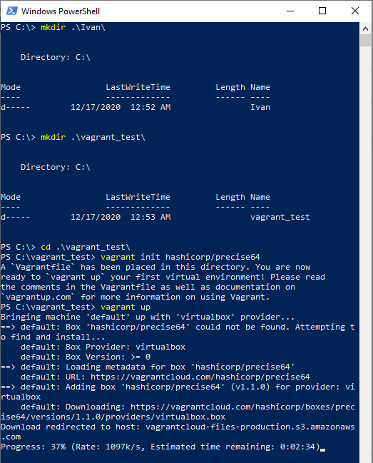
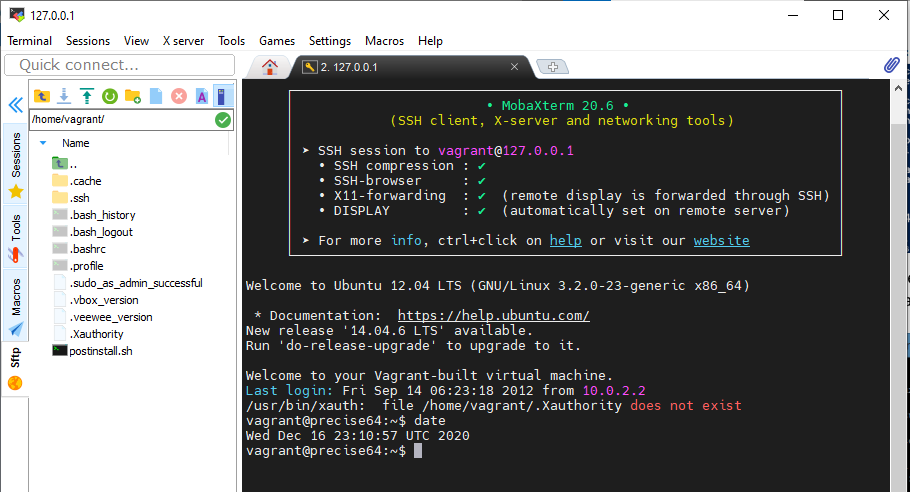
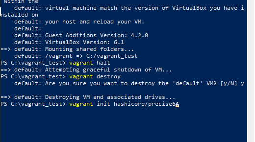
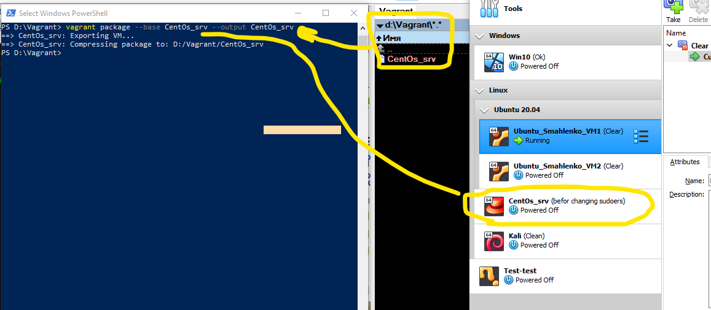

##### DevOps_online_Lviv_2020Q42021Q1
# Task2.1

### PART 1. HYPERVISORS

A hypervisor is a software layer that creates and manages many isolated virtual machines (VMs) on a single piece of equipment. Many different hypervisors are available. The most famous with which I often work or have worked* are the following:

  - *Oracle VM (VirtualBox)*
  - *Microsoft Hyper-V*
  - *VMware Workstation Player* - several times*
  
There are two types of hypervisors:

    Type 1 - the hypervisor is installed directly on the hardware
    Type 2 - the hypervisor is installed on the host OS

### PART 2. WORK WITH VIRTUALBOX
In this task, I worked with the VirtualBox hypervisor. All actions and their results can be seen in the following images:

    The Ubuntu 20.04 operating system was installed and named Ubuntu_Smahlenko.
    Next, this VM was cloned.

    
    These virtual machines were grouped into one group and a group test run was performed.

   
    Then several snapshots of different VM1 states were created.

        
    After that VM was exported to another folder...

      ... and then VM was imported into the VirtualBox.

  
    Then I added the USB flash drive and shared host folder.

.png)

After that, I checked the connection with various networks adapters settings.
The result is summarized in next image.

For more details You can see below.

###### Host-only Adapter:
    
- [(Settings)](./images/VirtualBox/NetW/Host-only/Settings.png)
- [(VM1 <-> Host)](./images/VirtualBox/NetW/Host-only/VM1-Host.png)
- [(VM1 <-> VM2)](./images/VirtualBox/NetW/Host-only/VM1-VM2.png)
- [(VM1 <-> Lan,Net)](./images/VirtualBox/NetW/Host-only/VM1-Net,Lan.png)

###### Internal NetWork:
    
- [(Settings)](./images/VirtualBox/NetW/Internal/Settings.png)
- [(VM1 <-> Host)](./images/VirtualBox/NetW/Internal/VM1-Host.png)
- [(VM1 <-> VM2)](./images/VirtualBox/NetW/Internal/VM1-VM2.png)
- [(VM1 <-> Lan,Net)](./images/VirtualBox/NetW/Internal/VM1-Net,Lan.png)

###### Bridged Adapter:
    
- [(Settings)](./images/VirtualBox/NetW/Bridge/Settings.png)
- [(VM1 <-> Host)](./images/VirtualBox/NetW/Bridge/VM1-Host.png)
- [(VM1 <-> VM2)](./images/VirtualBox/NetW/Bridge/VM1-VM2.png)
- [(VM1 <-> Lan,Net)](./images/VirtualBox/NetW/Bridge/VM1-Lan,Net.png)
- [(Lan,Net <-> VM1)](./images/VirtualBox/NetW/Bridge/Lan,Net-VM1.png)

###### Nat:
    
- [(Settings)](./images/VirtualBox/NetW/Nat/Settings.png)
- [(VM1 <-> Host)](./images/VirtualBox/NetW/Nat/VM1-Host.png)
- [(VM1 <-> VM2)](./images/VirtualBox/NetW/Nat/VM1-VM2.png)
- [(VM1 <-> Lan,Net)](./images/VirtualBox/NetW/Nat/VM1-Lan,Net.png)
- [(Lan,Net <-> VM1)](./images/VirtualBox/NetW/Nat/Lan,Net-VM1.png)

###### NAT Network:
    
- [(Settings)](./images/VirtualBox/NetW/NatNetw/Settings.png)
- [(VM1 <-> Host)](./images/VirtualBox/NetW/NatNetw/VM1-Host.png)
- [(VM1 <-> VM2)](./images/VirtualBox/NetW/NatNetw/VM1-VM2.png)
- [(VM1 <-> Lan,Net)](./images/VirtualBox/NetW/NatNetw/VM1-Net,Lan.png)
- [(Lan,Net <-> VM1)](./images/VirtualBox/NetW/NatNetw/VM1-Net,Lan.png)

___

Finally, in this part I worked with CLI through VBoxManage

###### CLI:
    
- [List, showvminfo](./images/VirtualBox/CLi/VBoxMan_list_showvminfo.png)
- [Startvm, controlvm, list)](./images/VirtualBox/CLi/Starting_CentOs_srv.png)
- [Createvm, Modifyvm](./images/VirtualBox/CLi/Modifyvm.png)
- [Clonehd](./images/VirtualBox/CLi/Clonehd.png)
- [Snapshot](./images/VirtualBox/CLi/Snapshot.png)

___

### PART 3. WORK WITH VAGRANT

According to my host OS I downloaded and installed the Vagrant program and made all the necessary settings. I initialized the environment (vagrant init) by default the Vagrant box, started (vagrant up).

I connected to the VM using the program MobaXterm, and recorded the date and time.

Than I stopped and deleted the created VM.

After that I created my own Vagrant box.

In the end, I ran a test virtual machine from my own Vagrant box.

___

#### I hope you have enough energy and time to review it all.) Thanks!

##### P.S. I add Vagrantfile below.
___

<pre style="color:#0080FF">  Vagrantfile

  # -*- mode: ruby -*-
  # vi: set ft=ruby :

  # All Vagrant configuration is done below. The "2" in Vagrant.configure
  # configures the configuration version (we support older styles for
  # backwards compatibility). Please don't change it unless you know what
  # you're doing.
Vagrant.configure("2") do |config|
  # The most common configuration options are documented and commented below.
  # For a complete reference, please see the online documentation at
  # https://docs.vagrantup.com.

  # Every Vagrant development environment requires a box. You can search for
  # boxes at https://vagrantcloud.com/search.
  config.vm.box = "CentOS_srv"

  # Disable default share folder
  config.vm.synced_folder ".", "/vagrant", disabled: true

  # Disable automatic box update checking. If you disable this, then
  # boxes will only be checked for updates when the user runs
  # `vagrant box outdated`. This is not recommended.
  config.vm.box_check_update = false

  # Create a forwarded port mapping which allows access to a specific port
  # within the machine from a port on the host machine. In the example below,
  # accessing "localhost:8080" will access port 80 on the guest machine.
  # NOTE: This will enable public access to the opened port
  # config.vm.network "forwarded_port", guest: 80, host: 8080

  # Create a forwarded port mapping which allows access to a specific port
  # within the machine from a port on the host machine and only allow access
  # via 127.0.0.1 to disable public access
  # config.vm.network "forwarded_port", guest: 80, host: 8080, host_ip: "127.0.0.1"

  # Create a private network, which allows host-only access to the machine
  # using a specific IP.
  # config.vm.network "private_network", ip: "192.168.1.138"

  # Create a public network, which generally matched to bridged network.
  # Bridged networks make the machine appear as another physical device on
  # your network.
  # config.vm.network "public_network"

  # Share an additional folder to the guest VM. The first argument is
  # the path on the host to the actual folder. The second argument is
  # the path on the guest to mount the folder. And the optional third
  # argument is a set of non-required options.
  # config.vm.synced_folder "../data", "/vagrant_data"

  # Provider-specific configuration so you can fine-tune various
  # backing providers for Vagrant. These expose provider-specific options.
  # Example for VirtualBox:
  #
  config.vm.provider "virtualbox" do |vb|
  #   # Display the VirtualBox GUI when booting the machine
  #   vb.gui = true
  #
    # Customize the amount of memory on the VM:
    vb.memory = "1024"
    # Name for MV
    vb.name = "CentOs_srv-test"
    # number of processor cores
    vb.cpus = 1
  end
  #
  # View the documentation for the provider you are using for more
  # information on available options.

  # Enable provisioning with a shell script. Additional provisioners such as
  # Ansible, Chef, Docker, Puppet and Salt are also available. Please see the
  # documentation for more information about their specific syntax and use.
  #config.vm.provision "shell", inline: <<-SHELL
  #   apt-get update
  #   apt-get install -y apache2
  # SHELL
end

