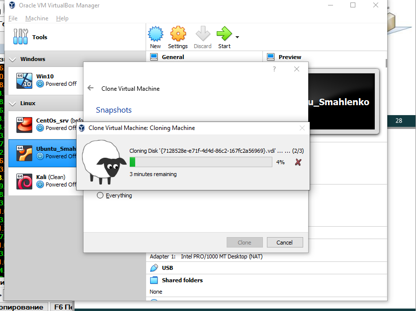
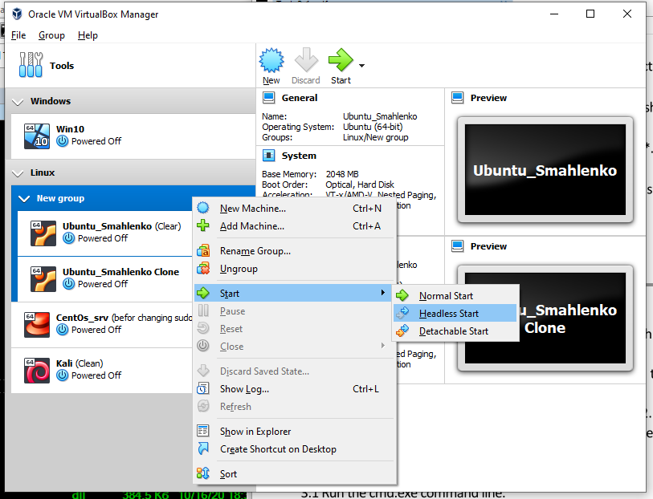
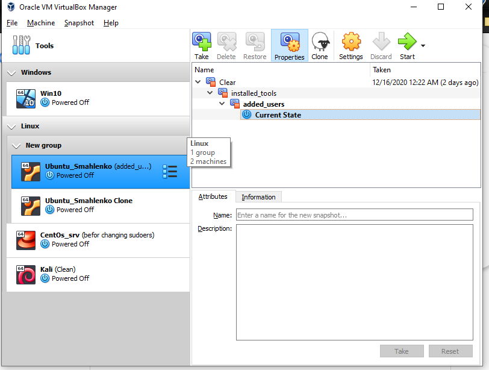
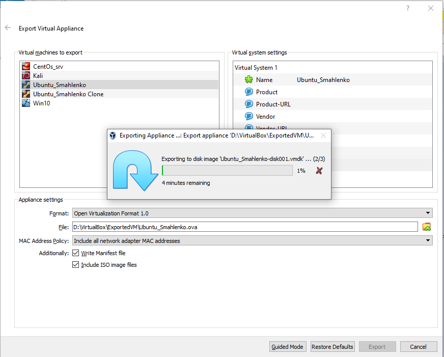
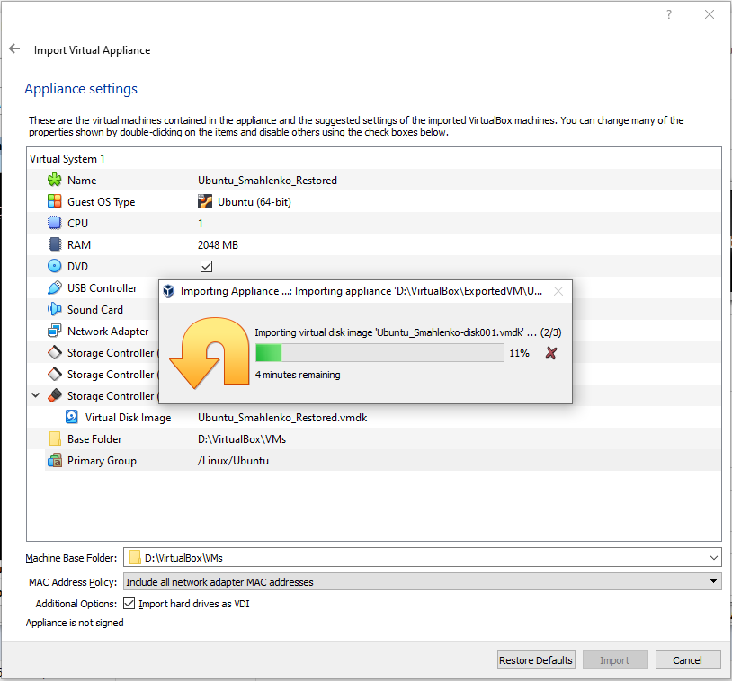
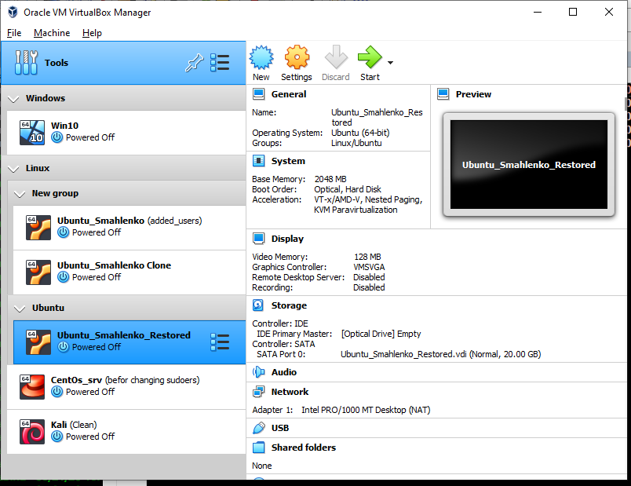
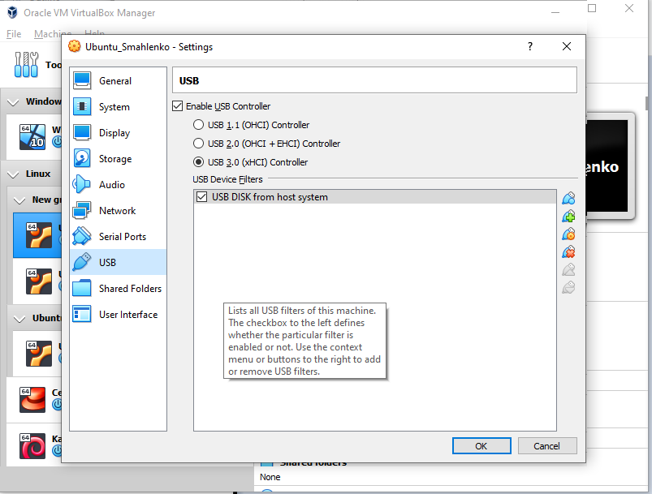
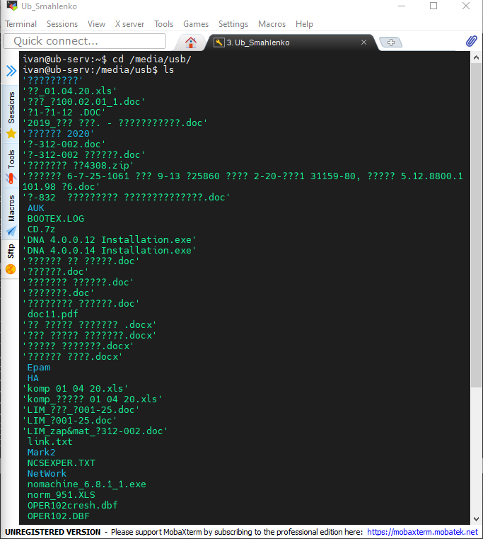
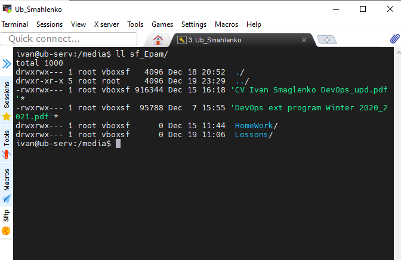
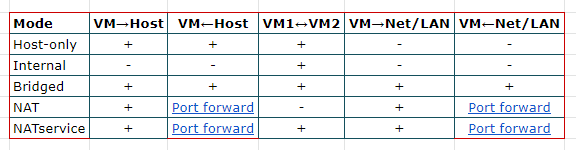

##### DevOps_online_Lviv_2020Q42021Q1
# Task2.1

### PART 1. HYPERVISORS

A hypervisor is a software layer that creates and manages many isolated virtual machines (VMs) on a single piece of equipment. Many different hypervisors are available. The most famous with which I often work or have worked* are the following:

  - *Oracle VM (VirtualBox)*
  - *Microsoft Hyper-V*
  - *VMware Workstation Player* - several times*
  
There are two types of hypervisors:

    Type 1 - the hypervisor is installed directly on the hardware
    Type 2 - the hypervisor is installed on the host OS

### PART 2. WORK WITH VIRTUALBOX
In this task, I worked with the VirtualBox hypervisor. All actions and their results can be seen in the following images:

    The Ubuntu 20.04 operating system was installed and named Ubuntu_Smahlenko.
    Next, this VM was cloned.

    
    These virtual machines were grouped into one group and a group test run was performed.

   
    Then several snapshots of different VM1 states were created.

        
    After that VM was exported to another folder...

      ... and then VM was imported into the VirtualBox.

  
    Then I added the USB flash drive and shared host folder.

.png)

After that, I checked the connection with various networks adapters settings.
The result is summarized in next image.

For more details You can see below.

###### Host-only Adapter:
    
- [(Settings)](./images/VirtualBox/NetW/Host-only/Settings.png)
- [(VM1 <-> Host)](./images/VirtualBox/NetW/Host-only/VM1-Host.png)
- [(VM1 <-> VM2)](./images/VirtualBox/NetW/Host-only/VM1-VM2.png)
- [(VM1 <-> Lan,Net)](./images/VirtualBox/NetW/Host-only/VM1-Net,Lan.png)

###### Internal NetWork:
    
- [(Settings)](./images/VirtualBox/NetW/Internal/Settings.png)
- [(VM1 <-> Host)](./images/VirtualBox/NetW/Internal/VM1-Host.png)
- [(VM1 <-> VM2)](./images/VirtualBox/NetW/Internal/VM1-VM2.png)
- [(VM1 <-> Lan,Net)](./images/VirtualBox/NetW/Internal/VM1-Net,Lan.png)

###### Bridged Adapter:
    
- [(Settings)](./images/VirtualBox/NetW/Bridge/Settings.png)
- [(VM1 <-> Host)](./images/VirtualBox/NetW/Bridge/VM1-Host.png)
- [(VM1 <-> VM2)](./images/VirtualBox/NetW/Bridge/VM1-VM2.png)
- [(VM1 <-> Lan,Net)](./images/VirtualBox/NetW/Bridge/VM1-Lan,Net.png)
- [(Lan,Net <-> VM1)](./images/VirtualBox/NetW/Bridge/Lan,Net-VM1.png)

###### Nat:
    
- [(Settings)](./images/VirtualBox/NetW/Nat/Settings.png)
- [(VM1 <-> Host)](./images/VirtualBox/NetW/Nat/VM1-Host.png)
- [(VM1 <-> VM2)](./images/VirtualBox/NetW/Nat/VM1-VM2.png)
- [(VM1 <-> Lan,Net)](./images/VirtualBox/NetW/Nat/VM1-Lan,Net.png)
- [(Lan,Net <-> VM1)](./images/VirtualBox/NetW/Nat/Lan,Net-VM1.png)

###### NAT Network:
    
- [(Settings)](./images/VirtualBox/NetW/NatNetw/Settings.png)
- [(VM1 <-> Host)](./images/VirtualBox/NetW/NatNetw/VM1-Host.png)
- [(VM1 <-> VM2)](./images/VirtualBox/NetW/NatNetw/VM1-VM2.png)
- [(VM1 <-> Lan,Net)](./images/VirtualBox/NetW/NatNetw/VM1-Net,Lan.png)
- [(Lan,Net <-> VM1)](./images/VirtualBox/NetW/NatNetw/VM1-Net,Lan.png)

___

Finally, in this part I worked with CLI through VBoxManage

###### CLI:
    
- [List, showvminfo](./images/VirtualBox/CLi/VBoxMan_list_showvminfo.png)
- [Startvm, controlvm, list)](./images/VirtualBox/CLi/Starting_CentOs_srv.png)
- [Createvm, Modifyvm](./images/VirtualBox/CLi/Modifyvm.png)
- [Clonehd](./images/VirtualBox/CLi/Clonehd.png)
- [Snapshot](./images/VirtualBox/CLi/Snapshot.png)

___

### PART 3. WORK WITH VAGRANT

I can say, DevOps is a kind of culture of behavior, when everyone tries to do 
everything to solve the problem or eliminate shortcomings. In production, the 
Devops engineer occupies an intermediate place between developers and production.
In my opinion, Devops-engineer must first understand the processes occurring in the
development-production cycle, be able to quickly find ways to solve new problems.

<pre style="color:#0080FF">$ vagrant --help
Usage: vagrant [options] &lt;command&gt; [&lt;args&gt;]

    -v, --version                    Print the version and exit.
    -h, --help                       Print this help.

Common commands:
     box             manages boxes: installation, removal, etc.
     cloud           manages everything related to Vagrant Cloud
     destroy         stops and deletes all traces of the vagrant machine
     global-status   outputs status Vagrant environments for this user
     halt            stops the vagrant machine
     help            shows the help for a subcommand
     init            initializes a new Vagrant environment by creating a Vagrantfile
     login
     package         packages a running vagrant environment into a box
     plugin          manages plugins: install, uninstall, update, etc.
     port            displays information about guest port mappings
     powershell      connects to machine via powershell remoting
     provision       provisions the vagrant machine
     push            deploys code in this environment to a configured destination
     rdp             connects to machine via RDP
     reload          restarts vagrant machine, loads new Vagrantfile configuration
     resume          resume a suspended vagrant machine
     snapshot        manages snapshots: saving, restoring, etc.
     ssh             connects to machine via SSH
     ssh-config      outputs OpenSSH valid configuration to connect to the machine
     status          outputs status of the vagrant machine
     suspend         suspends the machine
     up              starts and provisions the vagrant environment
     upload          upload to machine via communicator
     validate        validates the Vagrantfile
     version         prints current and latest Vagrant version
     winrm           executes commands on a machine via WinRM
     winrm-config    outputs WinRM configuration to connect to the machine

For help on any individual command run `vagrant COMMAND -h`

Additional subcommands are available, but are either more advanced
or not commonly used. To see all subcommands, run the command
