##### DevOps_online_Lviv_2020Q42021Q1
# TASK 2.2

### Module 2 Virtualization and Cloud Basic

With this task, I began working with Amazon Web Services (AWS). I read the terms of use of the Free AWS level and reviewed the necessary instructions and examples. The work was performed in the following services *S3, EC2, IAM, Elastic Container Service, EC2 Image Builder Elastic, Container Registry, Billing, Support*. 

First, following the example from the video, I created and started a server based on Amazon Linux 2 with *Amazon Lightsail*.
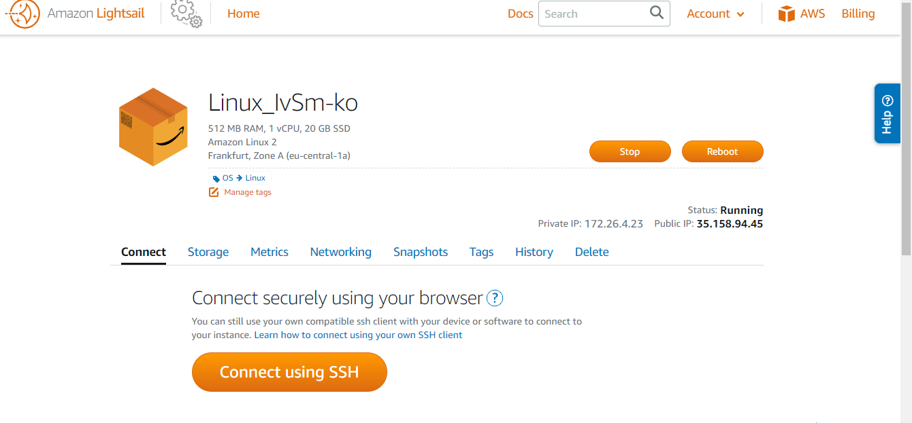

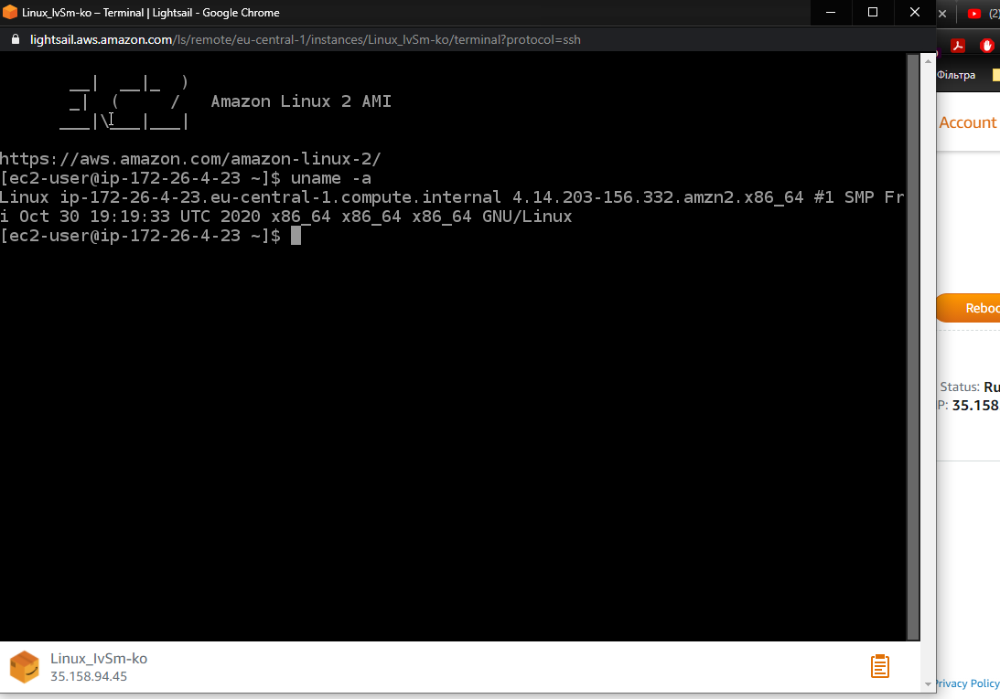
    Connect via a virtual console

Then I started another Linux virtual machine type t2.micro *without* using Amazon Lightsail...
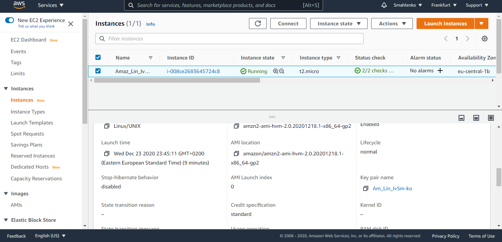

Created a snapshot of this instance...
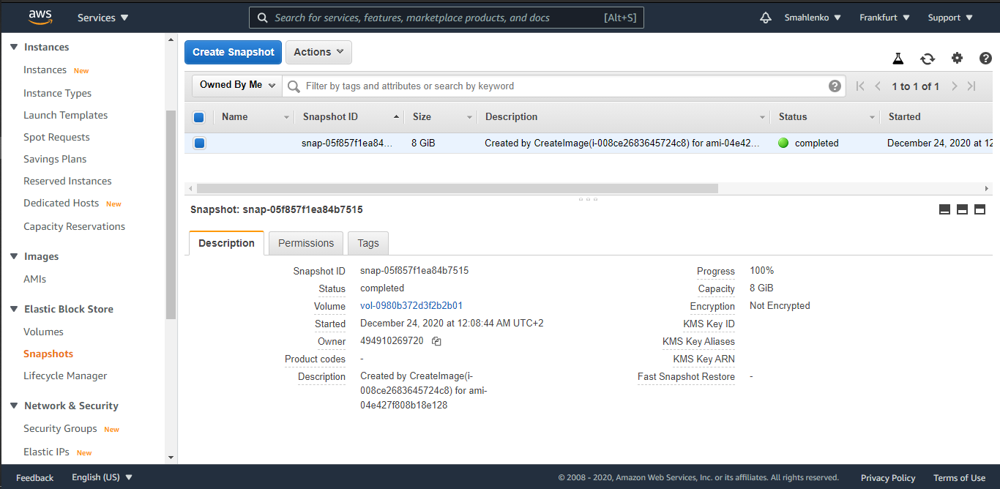

Created and attached a Disk_D (EBS) to this instance and saved test file on Disk_D.
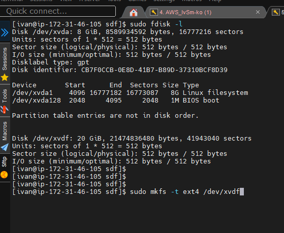

After that I launched the third instance from backup (created before), attached a Disk_D to this instance and read test file.
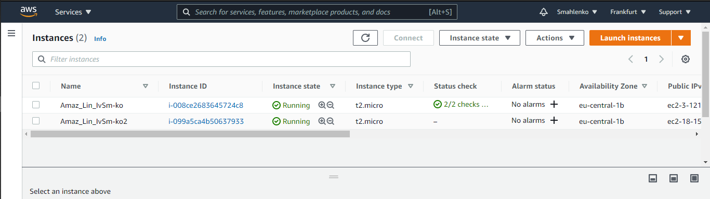

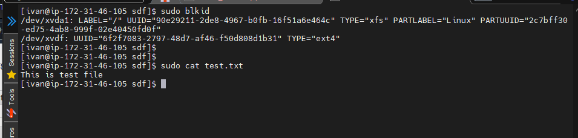

Launched and configured a WordPress instance with Amazon Lightsail.
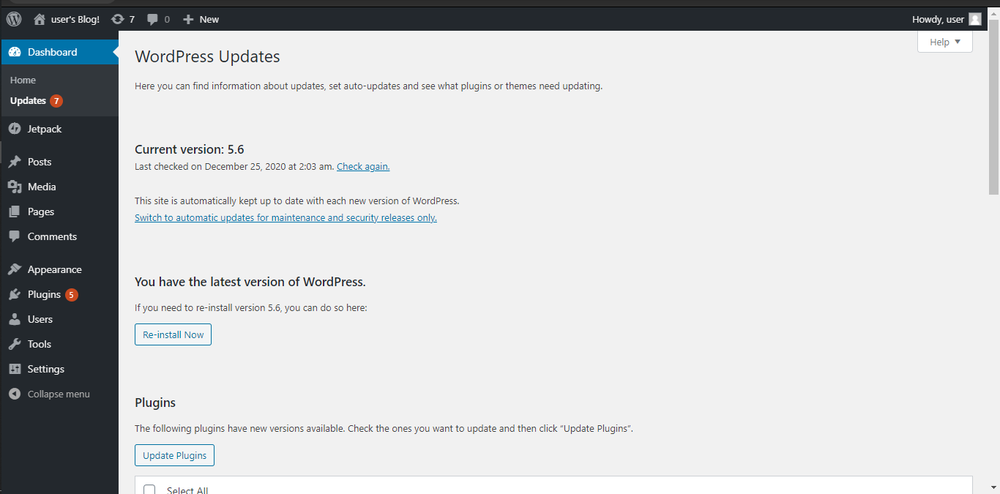    
    
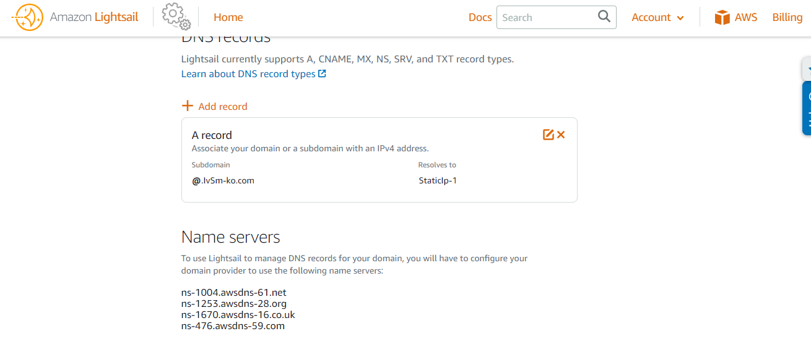    
    
Stored and Retrieved a File with Amazon S3 Bucket.
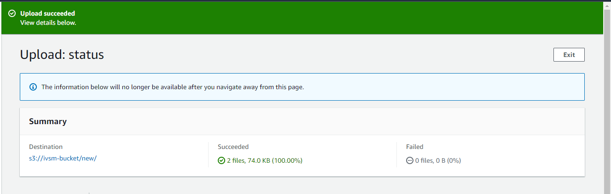   
    
Uploaded files to the cloud to Amazon S3 using the AWS CLI.
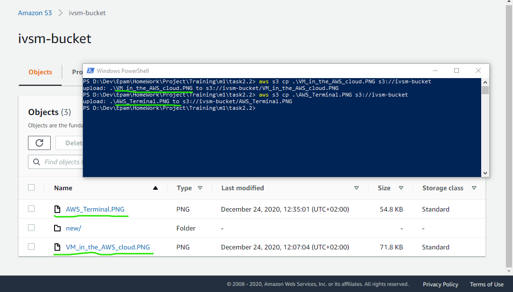   
    
Explore the possibilities of creating your own domain and domain name for your site.
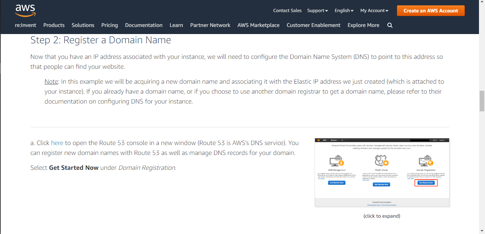    
    
Deployed Docker Container on Amazon Elastic Container Service (Amazon ECS).
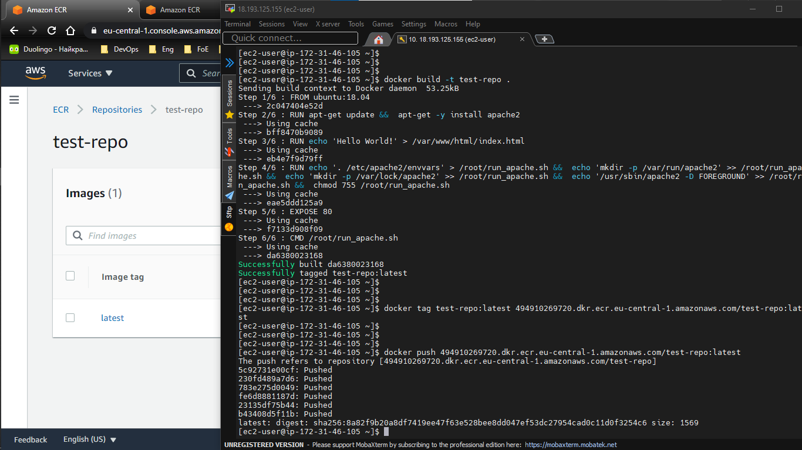     
    
Create a cluster, and run the application.
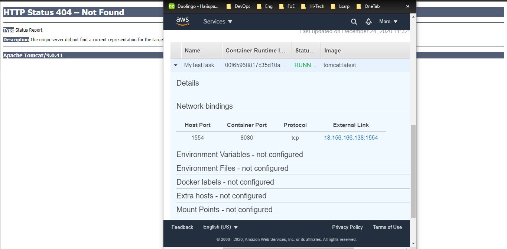 

And in the final stage, I created a static website on Amazon S3...
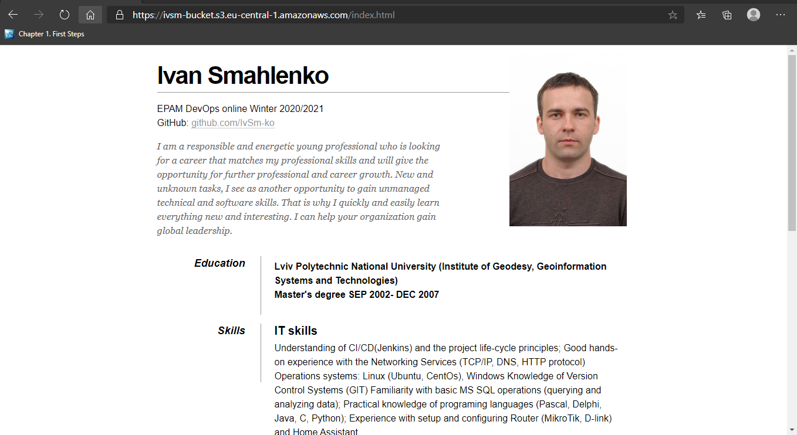

Can be found at: [https://ivsm-bucket](https://ivsm-bucket.s3.eu-central-1.amazonaws.com/index.html)

#### Thanks!
