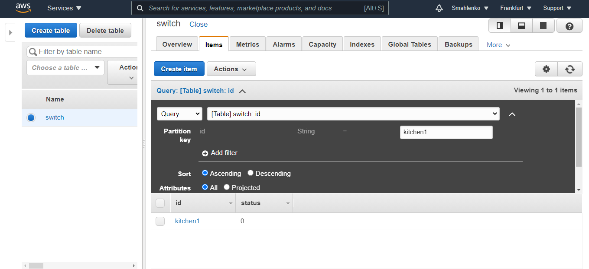

##### DevOps_online_Lviv_2020Q42021Q1
# TASK 2.2

### Module 3 Database Administration

## PART 1

This time I worked with databases. Exactly with the MySQL database. First, I installed the *mysql server* on my VB Linux machine. 

I decided to create a base for a vehicle workshop. I named it shop.

This a base contain 3 tables - client, car, work.

Then I made a few entries in these tables and execute SELECT operator with : *WHERE*, *GROUP BY* and *ORDER BY*

- [*WHERE*](./images/select_WHERE.png)
- [*GROUP BY* ](./images/select_GROUP_BY.png)
- [*ORDER BY*](./images/ORDER_BY.png)
- [*MODIFY*](./images/MODIFY.png)
- [*DELETE*](./images/DELETE.png)

Next step I created a new users ([*admin*](./images/created_admin.png), [*user*](./images/created_user.png)) with different privileges and made different actions with tables.

With *admin* I successfully tried to add data to the table *car* and see changes. Next I wanted to change the data type for one of the columns in this table. Access *denied*. 

Initially, I only give the *user* permission to SELECT, INSERT, DELETE and UPDATE for table *car*.

Then I only granted access to view the contents of the table *client*.

As a result, I got a database *shop*.

With such content:

___

## PART 2

I created a backup from the current database *shop.sql*.

I deleted the table *work*,

and recovered DB from backup with a command *< mysql -u root -p shop < shop.sql >*

I created DB on the AWS RDS service.

I transfered my local database to RDS AWS, connected to it and make *SELECT*.

Than I created the dump of database from AWS RDS.

___

## PART 3

I created and entered data into an Amazon DynamoDB table.

Queried an Amazon DynamoDB table using Query

and Scan

#### Thanks!
