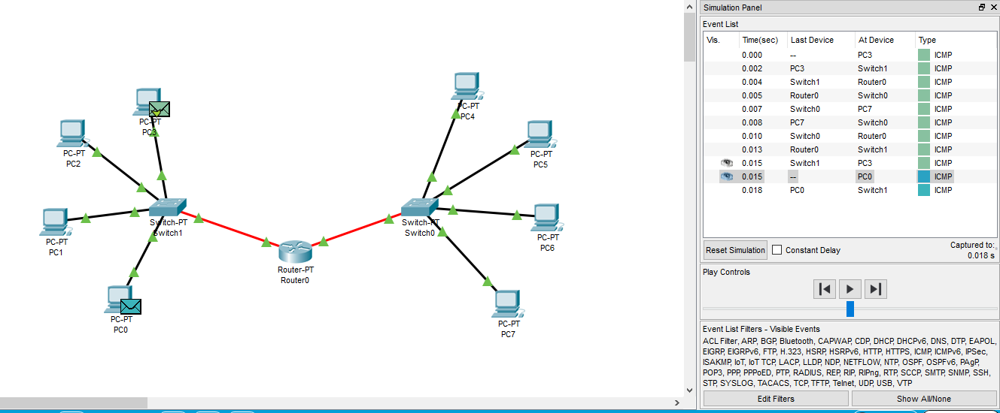

##### DevOps_online_Lviv_2020Q42021Q1
# TASK 4.1

### Module 4 Networking Fundamentals

In this task, I will work in a data network simulator - Cisco Packet Tracer, developed by Cisco Systems.

To begin with, I put together a project that connects 4 PCs connected by a *Hub-PT*. Enter a specific IP address for each PC according to the table.

I check the functionality of the received network by making requests on the Internet (ICMP packets) from one PC to another.

As we can see, this network works with the behavior inherent in hub networks. Namely, packets are sent to all PCs, regardless of the recipient.

By double-clicking on a package in the Simulation Panel window, I view information about the packages and their compliance with the OSI model.

By clicking the ***Next Layer*** button, I view the information that is happening with the packet on each of the three levels.

.png)

.png)

.png)

.png)

.png)

.png)

Now I delete IP addresses from all PCs. I'm trying to check the package delivery, but I'm getting an error :). This is because the IP address is not registered on the PC.

I'm putting together the next project. It includes: *PC0-PC5*, *Server* and *2 Hubs*. Devices of the same name are connected by a cross cable (*Copper cross*).

I assign an IP to each PC according to the given table.

At first glance, this network scheme works perfectly.

However, a closer look shows that there are numerous collisions and packet losses. This is due to the presence of identical hubs in this scheme.

.png)

.png)

I am creating the following project, which includes: 4 PCs, such as *PC-PT*, *Switch*. Each computer must be connected to the hub using twisted pair (*copper straight through*).

Unlike a hub network scheme, this network works to transmit packets only from recipient to recipient and back. All other PCs do not receive packages. we can see it in the right part (*Event List*) in the picture above.

I am expanding the project to the next. It includes: 8 PCs (*PC-PT*), 2 *Switches*. Each computer is connected to the switch by means of twisted pair (*copper direct through*), switches are connected by a cross cable (*copper cross*)

.png)

.png)

As we can see, everything is working properly. Packets are transmitted from destination to destination and back regardless of whether they pass through one Switch or through two Switches All other PCs do not receive packets. We can see this in the * Event List * in the picture below.

.png)

I divide the existing network into two levels of subnets. And I connect them with a router (*Router-PT*) with multiple ports. I connect the router and switches to each other using *Fiber*. Prescribe to the new PC IP addresses from the network *192.168.1.0/24*. And for all PCs we prescribe Default Gateway according to which port of the Router the Switch is connected.
We also prescribe routing on the Router so that PCs from the *192.168.0.1* network have the opportunity to send data to the PC of the new network and vice versa.

or statics...

We see that this network works properly.

Also here we can notice the difference between *Switches* that run on 2 levels of the OSI model.

.png)

And Routers that work on level 3 of this model.

.png)

Thanks to this work, I saw in real reflection the work of various equipment and the principles of the OSI model on which they are based.

P.S. project files are saved in a folder [***m1/task4.1/projects***](./projects/)

#### Thanks!
