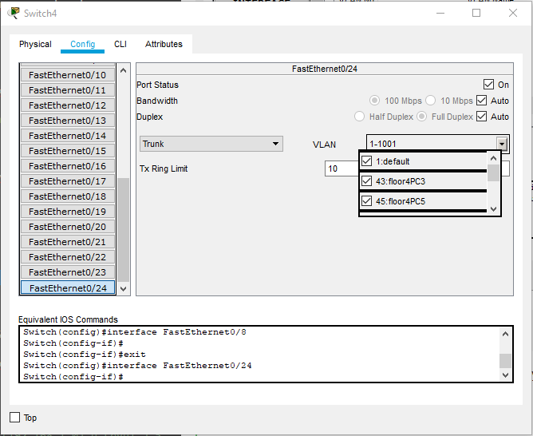

##### DevOps_online_Lviv_2020Q42021Q1
# TASK 4.2

### Module 4 Networking Fundamentals

##### *Task 1.*

In this task, I will keep working in a data network simulator - Cisco Packet Tracer, developed by Cisco Systems.

It is necessary to model the corporate network of the organization, which contains 2 houses with 2 floors in each. The horizontal floor subsystem consists of one workgroup of 5 computers. This network can be built in different ways, and it all depends on the tasks to be solved (availability between PCs etc.) and the funds allocated to it.

One of the simplest (and cheapest) options is to build using outdated *Hubs*.

But since this is not relevant today, consider several more options.

This option is more real. But as we see part of the PC (second floor, building №1) we still have no connection to the rest of the network. For these PCs we need to prescribe additional settings on the Router. Lets skip this step.

The following network scheme is optimal. It is relatively easy to sets up, but requires more equipment.

As we can see the packages successfully pass between the PCs of the two buildings. Namely from PC8 (located on the second floor of Building №2) to PC16 (located on the first floor of Building №1).

Another similar network option, but using two routers.

This option is best for quickly and flexibly setting up access between PCs of different workgroups without using *VLan* technology. In this case, we can safely divide all PCs into 4 isolated workgroups.

As we can see, the packages successfully pass between the PCs of the two buildings without causing much delay and no collisions or packet losses. Namely, from PC2 and PC7 (located on different floors of Building №2) to PC11 and PC17 (located in Building №1), respectively.

____
##### *Task 2.*

In this part of the task you need to simulate the corporate network of the organization, which contains *1 house* with *four floors*. The horizontal floor subsystem consists of two workgroups of 3 and 5 computers, respectively.
I decided to build this network on the basis of one router and 4 switches. This will, on the one hand, optimize the amount of used cable (materials) and equipment, fault tolerance and price

Next, I need to logically structure the network into 8 subnets (according to the number of workgroups). As I understand it, I need to isolate every group of computers on your subnet. I decided to do this using VLan technology.

To do this, I created two Vlans on each of the switches with the names of the numbers according to the location of the switches in the building and the number of PCs in them. For each switch:

- ***floor1PC3*** та ***floor1PC5*** - for the first;
- ***floor2PC3*** та ***floor2PC5*** - for the second;
- ***floor3PC3*** та ***floor3PC5*** - for the third;
- ***floor4PC3*** та ***floor4PC5*** - for the fourth;

    For the Switch on the second floor.

And for each network interface, Access or Trunk settings are specified, depending on the role it performs.

    To access PC4(3/3) in VLan 43 (4th floor, 3 PCs)

    Trunk port

All PCs are divided into subnets 192.168.1.0/24 ... 192.168.4.0/24 are registered according to the floors on which the PCs are located.
IPs on computers are registered depending on the floor / subnet and the group that includes this PC.

.png)

    As we can see, this PC is located on the ground floor (192.168.1.0) in a group of 5 computers and the third numbered (.53 in the IP address).
    
.png)

    As we can see, this PC is located on the fourth floor (192.168.4.0) in a group of 3 computers and the third number (.33 in IP addresses). 

Further I register All Vlan on routers.

At the moment, all computers are found on their subnets.

.png)

As can be seen from PC4 (3/3) (is located on the 4th floor in a group of three computers), successfully ping two other PCs in this group (192.168.4.31 and 192.168.4.32). And on the PC (wich is located behind the same switch 4 but in other group PK4 (2/5) with IP 192.168.4.52), pings do not pass.

In the future, I can configure access in different variations using Vlan settings on switches and on the router.

____
##### *Task 3.*

In this part of the task it is necessary to model the local network of the complex of 5 one-storey buildings. One building - 1 working group of 6 computers. The network is based on a router with one port.

And here many questions arise ... How are these buildings located relative to each other? What are the distances between them? And so on. Therefore, I chose a conditional scheme, according to which they are located at a distance of not more than 50 meters and one of them is in the center. 5 switches will be used to build the network (one for each building). A standard copper crossover cable will be used for switching. The router will be located in the central building.

Each switch has a VLan configured for a specific building. On each PC IP is registered according to which of the subnets 192.168.10.0/24 ... 192.168.50.0 they belong. Each switch has Access rights for a specific VLan to increase security. In this case, I need to be especially careful to configure the switch №4, because it has all 5 VLans. For each port to which the PC is connected, it is necessary to register only VLan40.

Now we try to ping computers in, say, the third building. Their subnet is 192.168.30.0/24. we will make it for two PC3(3/6) at it IP 192.168.30.4 and we will ping PC3(5/6) at it IP 192.168.30.6.

_to_PC3(5_6)_ping.png)

Now let's try on PC3(1/6) it has IP 192.168.30.2. And then on PC4(2/6) with IP 192.168.40.3 (because it is in VLan40) so check the isolation of groups.

_to_PC4(2_6)_ping.png)

As we can see the PC3(1/6) pings is also successful. But PC4(2/6) from another subnet and another VLan is not pinged.

Ok. Lets change the IP for the current PC to the IP from the subnet provided for VLan40, enter 192.168.40.15 and try to ping these two PCs again - PC3(1/6) from the same room and PC4(2/6) from another building.

_to_PC4(2_6)_ping2.png)

As we can see, we can't reach any PC successfully.

To successfully transfer data, I can use the properties of the router and configure routes between different VLan. Let's do this for building 5 (switch №5) and building 2 (switch №2). Before that I try to send a packet from PC5(5/6) to PC2(3/6).

_to_PC2(3_6)1.png)

As we can see, the package does not pass.

Enter the CLI of the router and enter the following commands:

  - *interface FastEthernet0/0*
  - *no shutdown*
  - *no ip address*
  - *interface FastEthernet0/0*
  - *ip address 192.168.1.1 255.255.255.0*
  - *interface FastEthernet0/0.50*
  - *encapsulation dot1q 50*
  - *ip address 192.168.50.1 255.255.255.0*
  - *description Vlan50*

As you can see, ARP packets successfully pass to the router and back to PC5(5/6).

Repeat the last four commands for VLan20. And we get the following result:

 

As we can see, packets are successfully transmitted from one VLan to another.

___

But these are not all possible options for network schemes to solve these task. It all depends on the problems which we must to resolv, the choice of equipment and budget.

P.S. project files are saved in a folder [***m1/task4.2/projects***](./projects/)

#### Thanks!
