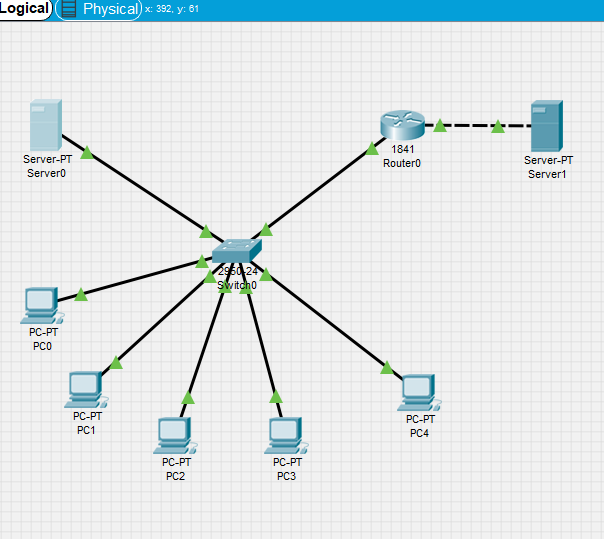
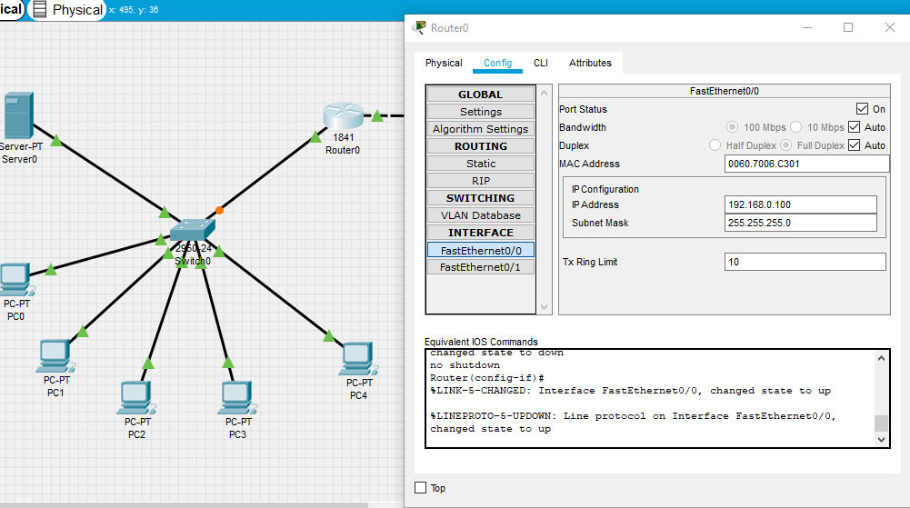
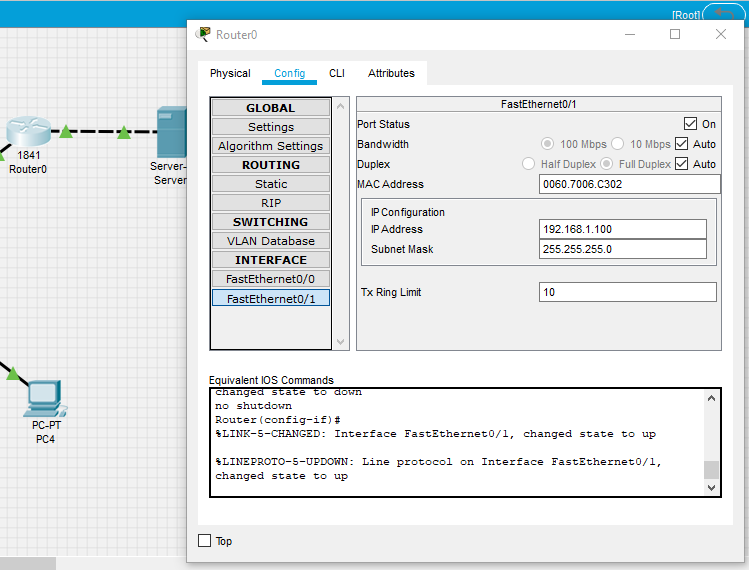
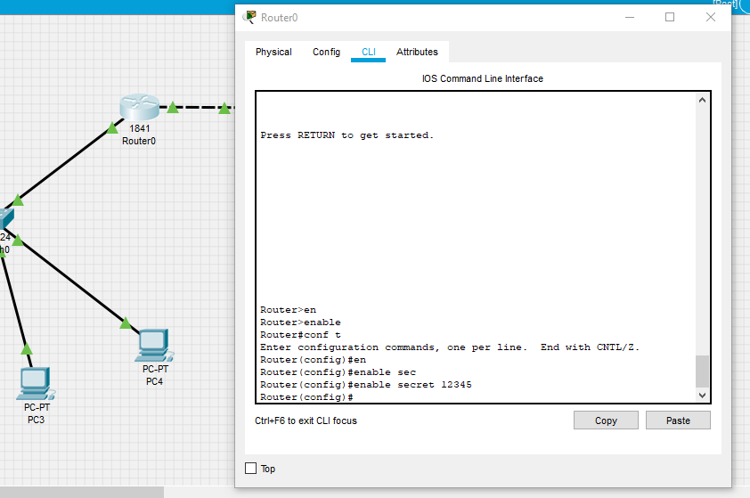
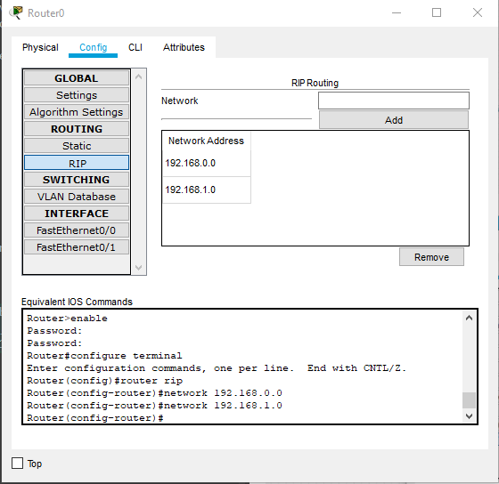
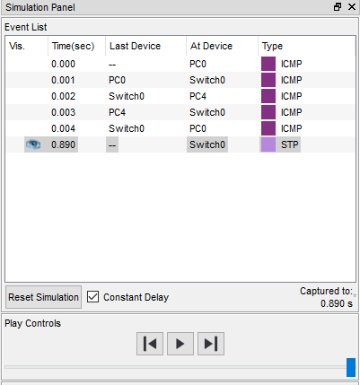
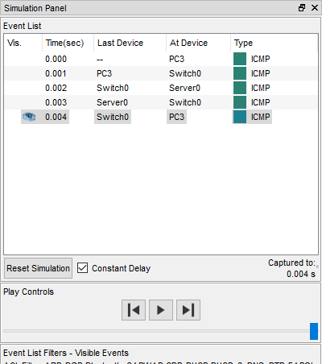
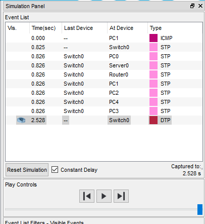
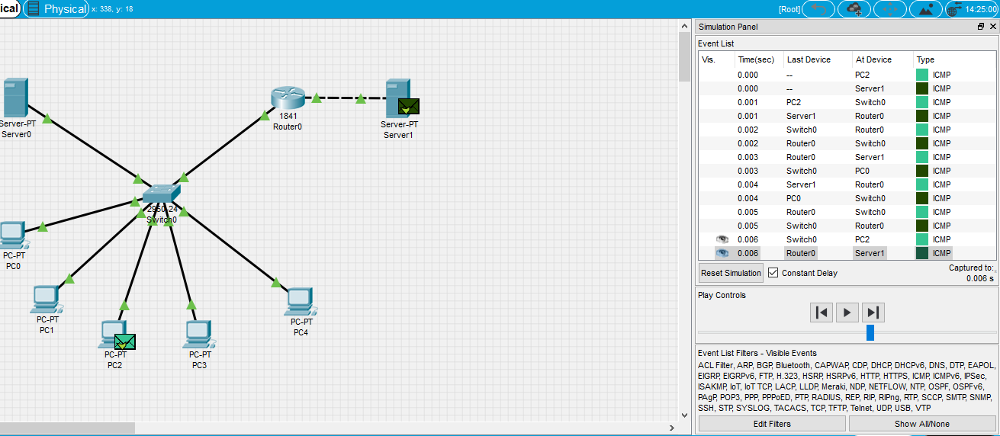

##### DevOps_online_Lviv_2020Q42021Q1
# TASK 4.3

### Module 4 Networking Fundamentals

In this task, I will keep working in a data network simulator - Cisco Packet Tracer, developed by Cisco Systems.

In this task, I must do the following:
Build a local area network consisting of a segment based on a switch, 5 computers and a server. The switch is connected to a router to which the server is also connected. I must specify static IP addresses for the network interfaces of routers, local computers, and servers. Configure RIP routing.

I have assembled the scheme as described and given. For each PC that I prescribed IP from diapason from 192.168.0.10 to 192.168.0.14. For Server which is connected to Switch, I prescribed  next IP - 192.168.0.1. And the server connected to the router - 192.168.1.1. The subnet mask is 255.255.255.0.

Next, I specify the appropriate ip addresses on the router interfaces and enable these ports.

Now I set the password to access the router via the Command Line Interface (CLI), using the ***enable secret*** command. And I save the configuration.

To access from the PC to the server1, which is behind the router, I need to prescribe the routing on the router. To do this, I open the conf, select RIP in Routing and added two Networks 192.168.0.0 and 192.168.1.0

I need to check the availability of workstations. To do this, at the top on the toolbar, I choise ***Add simple PDU*** and select the sending station and receiving station. We make sure that the transfer is completed successfully.
Everything seems cool. Packets between PCs run:

Between the PC and the local Server0, also run:

But between the local network and the external Server1 (which is out of the to Router) packets do not pass:

This is all because I acted solely according to the instructions. And in it it is not specified to set default gateway. Fix it for Server1, PC0, PC1, PC2 and see that the packets ran  :)

#### Thanks!

P.S. project file is saved in a folder [***m1/task4.3/project***](./project/)

