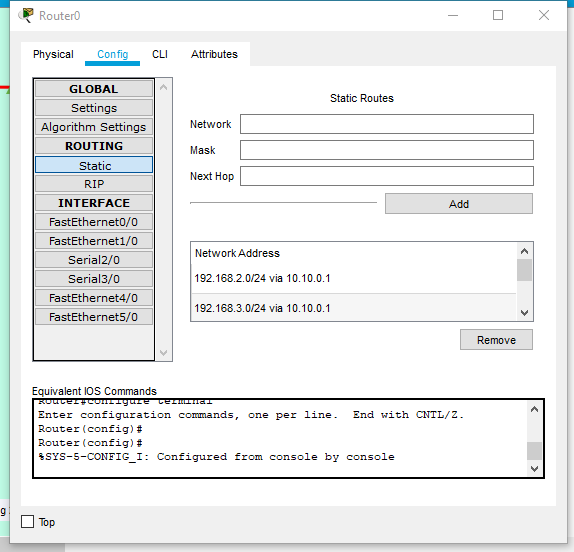
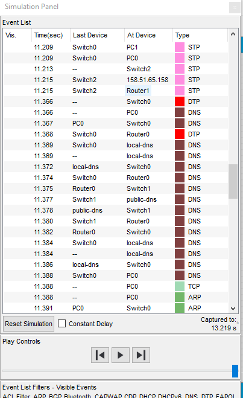

##### DevOps_online_Lviv_2020Q42021Q1
# TASK 4.4

### Module 4 Networking Fundamentals

##### *Task 1.*

I have done these in the task 4.2 part 1.

As we can see, the packages successfully pass between the PCs of the two buildings without causing much delay and no collisions or packet losses. Namely, from PC2 and PC7 (located on different floors of Building №2) to PC11 and PC17 (located in Building №1), respectively.

Here I just  want add, that communication between routers is by network 10.10.0.0 and static routing.

____
##### *Task 2.*

At these part of task I must configure subnets and DNS. I create a project according to the task and have configured one server as a local DHCP and DNS, static IP 192.168.0.100. Another one I have configure as a public DNS server and maked link to phantom-site on it www.ivsm-ko.com. On the router I prescribed a static IPs for each subnets and configure RIP routing.

Then I opened command prompt on the PCO and started command ping to phantom-site ww.ivsm-ko.com. All comed with success.

I decided not to stop there. And I added another Server to them and redirected the link to the phantom site. I added one more Router and Switch too. I prescribed static route between Routers using subnet 10.10.10.0. Site Server I put to the network 158.51.65.152/29.

The result was great.

Cisco Packet Tracer is a great tool for such works.

#### Thanks!

P.S. project file is saved in a folder [***m1/task4.4/project***](./project/)

