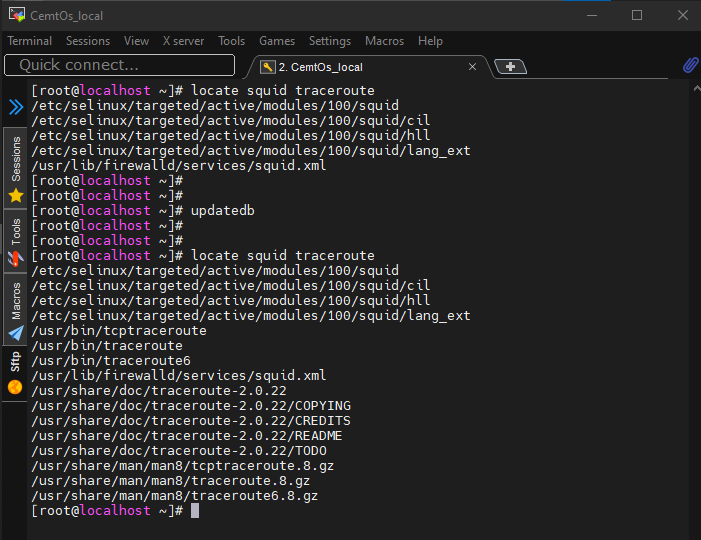

##### DevOps_online_Lviv_2020Q42021Q1
# TASK 5.1

### Module 5 Linux essentials.

##### *Part1.*

In this task, I continue to practice the Linux operating system, but this time we will configure the operating system directly.
One of the first steps, as usual, is to create user (users), group (groups) and set permissions for them.
I created user ***test1*** and set a simple password for it. We can see that in file */etc/passwd*. 

I then set limits for time to this password, notification in three days before it expires and then configure that user have to change the password at first login.

From the */etc/passwd* file we see that I have created the following users: ***sia, Ivan, vagrant*** and ***test1***. We can do this with an identifier that exceeds 1000. We can also see that in the system in addition to the ***root*** there are users created by the system for its needs and who do not have the right to log in (nologin). Olso we can see the users default shell, password status (set or not).

With the help of the command ***chfn*** I change the information about the user *test1*.

We use commands ***man*** and ***info*** to find a description about how works some command or how to write a syntaxes. Often used *man*, but *info* can provides some additional information about interesting us command, and I think, it a little bit more easy to read. Both commands give us almost the same functionality, but in *info* we can scroll pages or move the highlighted cursor on the screen. 
We can use command ***man*** with such keys:

**-f** - display a short description from the manual page, if available. Equivalent to ***whatis***.
**-k** - search the short  manual  page descriptions  for keywords and display any matches.  Equivalent to ***apropos***. 

We can use command ***info*** with such keys: 
**-w**,  -- location print physical location of Info file. Equivalent to  ***where***.
**-k**,  -- look up STRING in all indices of all manuals.Equivalent to ***apropos***.

Than I explored the ***more*** and ***less*** commands using commands ***man*** and ***info***.

I then explored the ***more*** and ***less*** commands using the ***man*** and ***info*** commands. I looked at the contents of the *~/.bash_hystory, ~/.bash_logout, ~/.bash_profile, ~/.basrc* files (***.bash\****). And I see the difference between *less* and *more*. When I use * more *, it shows what is inside each of files inline, when I use *less*, it open the "new screen" (open in redactor).

If I use the ***-N*** key for *less*, we can see a list of numbered lines.

I installed ***finger*** and used it.

I then outlined what I was working on in Lab 5.1, and used the *finger* command again.

Another command that is most commonly used is ***ls***. You can use it to view the contents of directories.
Combining the keys for this command this content may be different.
Namely:

***-l*** - shows file and directory properties (rights, owner, adjustment date, type);
***-a*** - shows all the contents of the directory (hidden folders and files);
***-t*** - sort by modification time, newest first;
***-r*** - reverse order while sorting;
***-R*** - list subdirectories recursively.

____
##### *Part2.*

I used the ***tree*** command. Mastered the technique of drawing a template. I found all the files that contain the **c** character in the *root* home directory and than files that contain the **ash** characters.

I listed subdirectories of the *root* directory and than i made the same including only the second nesting level.

To determine the type of file (for example, text or binary) we can   can be used ***file***. For example I checked  ***txt***, ***png*** and ***html*** file types.

To move between different directories of the file system we can using relative and absolute paths.

 To come back to your home directory from anywhere in the file system we can use ***cd ~/*** command.

Next I need to perform some actions with ***ls*** command and describe what means some keys for these command, but I did these at the end of the first part of the task.

Now I need to execute a certain sequence of commands. The result in the following image.

Now I need to execute the following specific sequence of commands. I copied the file ***. Bash_history*** to the created directory ***test*** with ***labwork2*** name. Also create a hard and symvolik links to the copied file. They can be distinguished by the size of the file. The hard link has the same size as the original file ***labwork2***, but a different name. The symbolic link is smaller and contains a ***l*** in front of the permissions and an arrow indicating the name of the original file. Using the *** touch *** command, I updated the date of the file because the symbolic link only indicates the path to the file.

Then I renamed the links and deleted the file *labwork2*. As a result, the symbolic link turned red, indicating the absence of the file to which it points.

Using the locate utility, I found all the files that contain the squid sequence and traceroute.

After executing the ***df -aTh*** command, we see that the two root and boot partitions are mounted. Then the command ***lsblk*** types of these sections.

Next I need to count the number of lines with a certain sequence of characters. I found the commands where the word **user** occurs and chose one of them. Then with the ***man*** command I opened the description to the ***id*** command and with the ***grep*** and ***wc -l*** commands I counted how many lines the word contains ** user **.

I found all files in the **/etc** directory containing the
host character sequence using the ***find*** command.

I listed all objects in /etc that contain the ss character sequence.

Output the contents of the / etc directory in page mode using the ***less*** command and redirect the output.

Device files are marked as follows:
***c*** - character
***b*** - block
***p*** - pipe
***s*** - socket
To see which devices and which types are present in the system, let's look at the contents of the ***/dev/*** directory. The first characters indicate the device type.

To determine the file type in Linux, we can use the ***file*** command. This command runs three sets of tests: the filesystem test, magic number test, and language test. The first test that succeeds causes the file type to be printed.

I listed the first 5 directory files that were recently accessed in the /etc directory.

#### Thanks!

