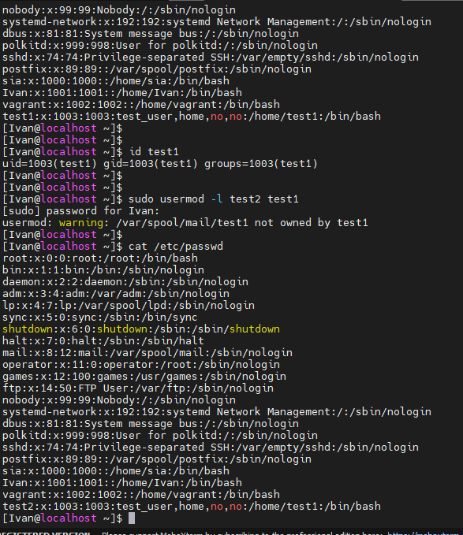

##### DevOps_online_Lviv_2020Q42021Q1
# TASK 5.2

### Module 5 Linux essentials.

1) In this task, I will work with users and groups in the Linux operating system.
Records of all the users which are registered in the system we can find in ***/etc/passwd*** file.

In the image we see the following fields in order from left to right:

- ***test1***: User name: the string a user would type in when logging into the operating system: the logname. Must be unique across users listed in the file;
- ***x***: Information used to validate a user's password; in most modern uses, this field is usually set to "x" (or "\*", or some other indicator) with the actual password information being stored in a separate ***shadow*** password file. On Linux systems, setting this field to an asterisk ("*") is a common way to disable direct logins to an account while still preserving its name, while another possible value is "\*NP\*" which indicates to use an NIS server to obtain the password;
- ***1003***: user identifier number, used by the operating system for internal purposes. It need not be unique;
- ***1003***: group identifier number, which identifies the primary group of the user; all files that are created by this user may initially be accessible to this group;
- ***test_user,home...:*** Gecos field, commentary that describes the person or account. Typically, this is a set of comma-separated values including the user's full name and contact details;
- ***/home/test1*** Path to the user's home directory;
- ***/bin/bash:*** Program that is started every time the user logs into the system. For an interactive user, this is usually one of the system's command line interpreters (shells).

We can now identify all users who are currently present on the system. We see that there are twenty two users. Only four of them were created by me, they have a UID more than 1000. And all other users (they have a UID of less than 1000) were created by the system during its installation or during the installation of software or to start a process. Among them we see the main user of the system ***root*** and pseudo-users such as ***sshd***, ***postfix***, ***sync*** etc.

2) A UID - user identifier, is a number assigned by Linux to each user on the system. This number is used to identify the user to the system and to determine which system resources the user can access. Most Linux distributions reserve the first 100 UIDs for system use. New users are assigned UIDs starting from 500 or 1000. For example, new users in Ubuntu or CentOs start from 1000. 
We can use the ***id*** command to determine the UID. Example for *test1* user uid is *1003*.

3) A group ID, in Linux often abbreviated to ***GID***, is a numeric value used to represent a specific group. The range of values for *GID* differs in different systems; at least *GID* can be between ***0*** and ***32,767***, with one limitation: **superuser login group (***root***) must have GID 0**. Like the UID, the first 1000 GIDs are usually reserved for use in the system. This numeric value is used to refer to groups in the ***/etc/passwd*** and ***/etc/group*** files or their equivalents.

4) We can use the ***id*** command to also define a GID for the user. An example for *test1* user *GID* is *1003*. And we will see all the groups that contain the user.

The general syntax for the ***useradd*** command is as follows:
   
    useradd [OPTIONS] USERNAME

When we run ‘useradd‘ command in Linux terminal, it performs following major things:

- It edits /etc/passwd, /etc/shadow, /etc/group and /etc/gshadow files for the newly created User account.
- Creates and populate a home directory for the new user.
- Sets permissions and ownerships to home directory.

5) We can create a *user* with different home directory using ***-d*** option along with the location of new home directory.

      useradd -d /data/different test2

The ‘-G‘ option is used to add a user to additional groups. For an example, we are adding a user ***test2*** into multiple groups like *admins, webadmin* and *developer*.

      useradd -G admins,webadmin,developers test2

To create user’s without their home directories, ‘-M‘ is used. For example, the following command will create a user ***test2*** without a home directory.

      useradd -M test2

6) I need to use the ***usermod*** command to change user name under a Linux operating systems. This command modifies the system account files to reflect the changes that are specified on the command line.

The syntax is as follows to rename by user name:

      usermod -l new-login-name old-name

I changed user ***test1*** to ***test2***.

7) The ***/etc/skel*** directory contains files and directories that are automatically copied over to a new user’s when it is created from useradd command.

The contents of the ***skel*** directory are copied to the home directory of each newly created user. And it is possible to configure the content, you can add the necessary files and folders.

8) To remove a user from the system (including his mailbox) I use ***userdel --remov*** *user* command.

9) What commands and keys should be used to lock and unlock a user account?

To lock user in Linux system we can use a few commands:

- *passwd* ***-l*** *user* ;
- *usermod* ***-L*** *user* ;
- *usermod* ***-s /sbin/nologin*** *user*

To unlock user in Linux system we can use a the same commands but with others keys:

- *passwd* ***-u*** *user* ;
- *usermod* ***-U*** *user* ;
- *usermod* ***-s /sbin/bash*** *user*.

10) To delete the user's password and give him a login without a password to further change the password, I used the *** passwd *** command. First with the ** - d ** key (deleted password), and then with the ** - e ** key (the user must set a password on the next login).

11) We can use the **ls -l** command to list the extended format of information about the directory. It shows the contents of the directory in a table format with columns including:

   - *content permissions* (for ***ugo***) *+ sticky bits*;
   - *number of links to the content*;
   - *owner of the content*;
   - *group owner of the content*;
   - *size of the content in bytes*;
   - *last modified date/time of the content*
   - *file or directory name*.

12) ***File Access*** are the first line of defense in the security of a Linux system. The basic of Unix permissions are the read, write, and execute permissions, which have been described below :

- ***r*** - *Read* - grants the capability to read, i.e., view the contents of the file.
- ***w*** - *Write* - grants the capability to modify, or remove the content of the file.
- ***x*** - *Execute* - grants the capability to run a file as a program.

***Directory access*** modes are listed and organized in the same manner as any other file. There are a few differences that need to be mentioned −

- ***r*** - *Read* -  means that the user can read the contents of the directory. The user can look at the filenames inside the directory.
- ***w*** - *Write* - means that the user can add or delete files from the directory.
- ***x*** - *Execute* - Executing a directory doesn't really make sense, so think of this as a traverse permission.

File ownership is an important component of Unix that provides a secure method for storing files. Every file in Linux has the following attributes −

- ***Owner permissions*** − The owner's permissions determine what actions the owner of the file can perform on the file.

- ***Group permissions*** − The group's permissions determine what actions a user, who is a member of the group that a file belongs to, can perform on the file.

- ***Other (world) permissions*** − The permissions for others indicate what action all other users can perform on the file.

13) Ownership of files in Linux and access authority are closely related to user ids and groups. Just as every user has an ID and is a member of one primary group, so every file on a Linux system has one owner and one group associated with it.
The Linux permission model has three types of permission (rwx) for each filesystem object. In addition, these permissions are specified separately for the file’s owner, members of the file’s group, and everyone else.
Directories use the same permissions flags as regular files, but they are interpreted differently.
When we log in, the new shell process runs with your user and group IDs. These are the permissions that govern our access to any files on the system. This usually means that you cannot access files belonging to others and cannot write system files. In fact, users are totally dependent on other programs to perform operations on our behalf. Because the programs we start inherit our user id, they cannot access any filesystem objects for which we haven’t been granted access.

14) By default, the owner cannot use the chown command to change the owner of a file or directory. However, you can enable the owner to use the chown command by adding the following line  (***set rstchown = 0***) to the system's /etc/system file and rebooting the system.

- ***chown*** - changes the owner of file system files and directories

- ***chgrp*** - changes the group associated with a file system object

***chown*** changes the user and/or group ownership of each given file. If only an owner (a user name or numeric user ID) is given, that user is made the owner of each given file, and the files group is not changed. If the owner is followed by a colon and a group name (or numeric group ID), with no spaces between them, the group ownership of the files is changed as well. If a colon but no group name follows the user name, that user is made the owner of the files and the group of the files is changed to that user's login group. If the colon and group are given, but the owner is omitted, only the group of the files is changed; in this case, ***chown*** performs the same function as ***chgrp***. If only a colon is given, or if the entire operand is empty, neither the owner nor the group is changed.

15) Example octal: ***744***

Owner Permissions - 7 = rwx
Group Permissions - 4 = r--
Other Permissions - 4 = r--

When user create a file or directory under Linux, she create it with a default set of permissions. In most case the system defaults may be open or relaxed for file sharing purpose. For example, if a text file has 666 permissions, it grants read and write permission to everyone. Similarly a directory with 777 permissions, grants read, write, and execute permission to everyone.
We can setup ***umask*** in */etc/bashrc* or */etc/profile* file or type the following command ***umask 077*** for all users. By default most Linux distro set it to 0022 (022) or 0002 (002). 

16) Anyone with write permission to a directory can delete files in it. This might be acceptable for a group project, but is not desirable for globally shared file space such as the /tmp directory. But there is a solution of these problem.

The access mode bit is called the sticky bit. It is represented symbolically by ***t*** and numerically as a ***1*** in the high-order octal digit. It is displayed in a long directory listing (***ls -l***) in the place of the executable (***x***) flag for other users (the last character), with the same meaning for upper and lower case as for suid and sgid. If set for a directory, it permits only the owning user or the superuser (***root***) to delete or unlink a file. 
On a historical note, UNIX® systems used to use the sticky bit on files to hoard executable files in swap space and avoid reloading. Modern Linux kernels ignore the sticky bit if it is set for files.

  
  
17) We need to add execution (***x***) permissions to all sets (***ugo***) for the script file. To do this, we can use the following command: 

        chmod a+x file_name 

  

____

Having done this task, I deepened my knowledge of users, groups, their rights and permissions for files and directories.

#### Thanks!

