/#### DevOps_online_Lviv_2020Q42021Q1

## TASK 5.3

### Module 5 Linux essentials.

#### Part1

____

1) In Linux, a process has the following possible states:

Here are the different values that the s, stat and state output specifiers (header "STAT" or "S") will display to describe the state of a process:

     D    uninterruptible sleep (usually IO)
     R    running or runnable (on run queue)
     S    interruptible sleep (waiting for an event to complete)
     T    stopped by job control signal
     t    stopped by debugger during the tracing
     W    paging (not valid since the 2.6.xx kernel)
     X    dead (should never be seen)
     Z    defunct (zombie) process, terminated but not reaped by its parent

For BSD formats and when the stat keyword is used, additional characters may be displayed:

     <    high-priority (not nice to other users)
     N    low-priority (nice to other users)
     L    has pages locked into memory (for real-time and custom IO)
     s    is a session leader
     l    is multi-threaded (using CLONE_THREAD, like NPTL pthreads do)
     +    is in the foreground process group

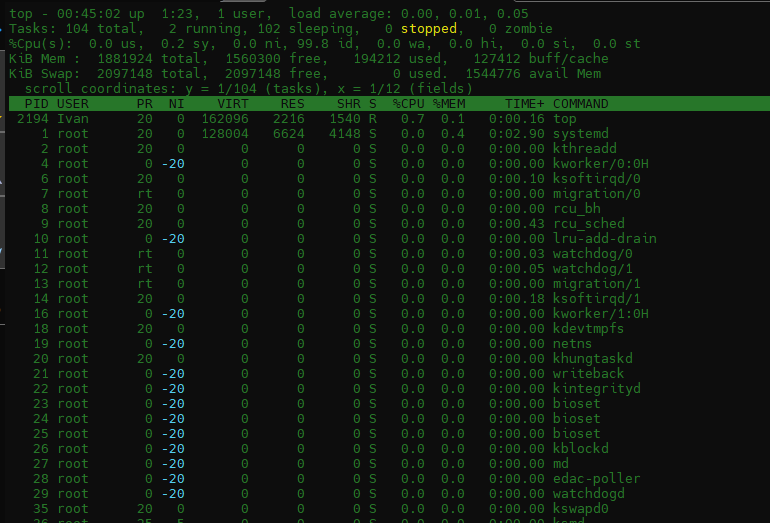

2) I studied the ***pstree*** command. I deduced the chain (ancestors) of the current process.

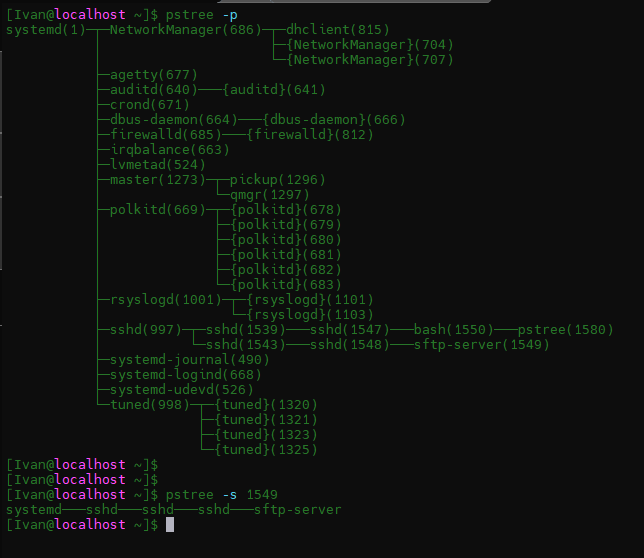

3) The ***/proc*** filesystem contains a illusionary filesystem. It does not exist on a disk. Instead, the kernel creates it in memory. It is used to provide information about the system (originally about processes, hence the name).

4) Using ***lscpu*** or ***cat /proc/cpuinfo*** command we can get information about the processor (its type, supported technologies, etc.).

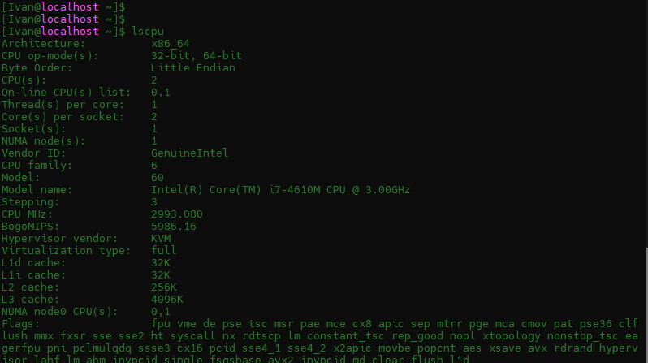
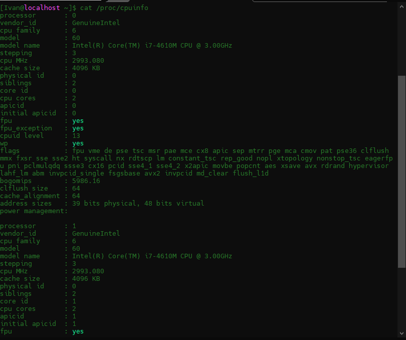

5) I used the ***ps -eo pid,ppid,pri,user,fgid,rgroup,tty,args --sort user*** command to get information about the process. The information contains: the process id, parent process ID,  the group owner of this process owner of the process, ttylist, the arguments with which the process was launched for execution and all output is sorted by user.

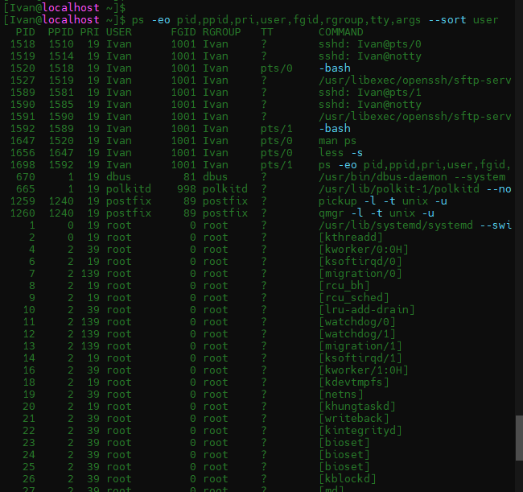

6) The processes of the linux kernel are started by the kernel itself, with the parent process allegedly generating them, the process kthread is assigned, with *PID = 2*. Thus the kernel processes should be considered the process with *PID = 2*, as well as processes in which *PPID (ie parent pid) is 2* .

Kernel processes will show ***sudo pstree 2*** or ***sudo ps -N --ppid = 2 --pid = 2***
user processes - everything else
Similarly, by default pstree without parameters shows only the tree of processes generated by init, ie user-defined processes.

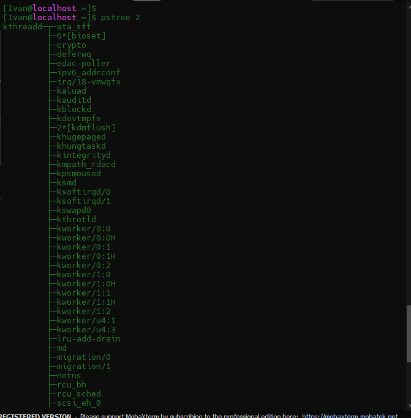
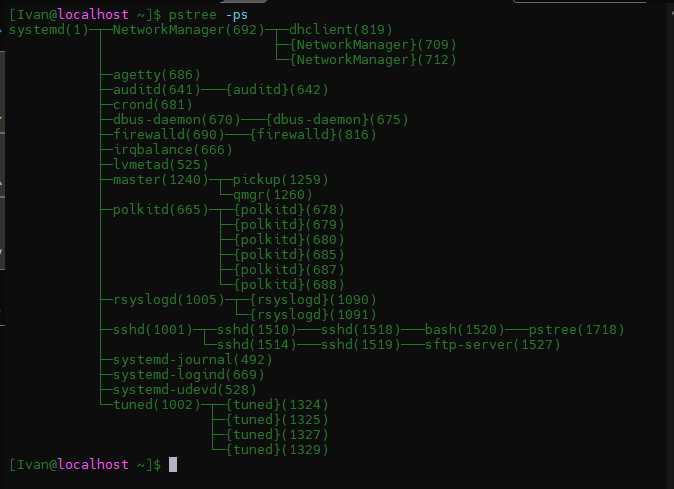

7) 
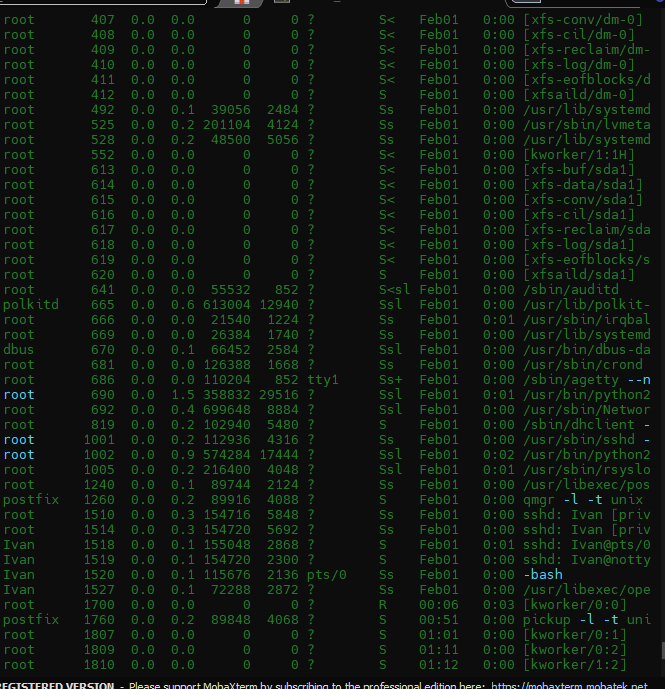

     S - proces is on the interruptible sleep (waiting for an event to complete)
     S< - proces is whith high-priority and it is on the interruptible sleep 
     Ss - proces is a session leader, it is on the interruptible sleep
     Sl< - proces is multi-threaded with high-priority and it is on the interruptible sleep
     Ssl - proces is a multi-threaded session leader, it is on the interruptible sleep
     S<sl - proces is a high-priority multi-threaded session leader, it is on the interruptible sleep
     Ss+ - proces is a session leader, is on the interruptible sleep, is in the foreground process group
     R - proces is runing

8) Display only the processes of a specific user.

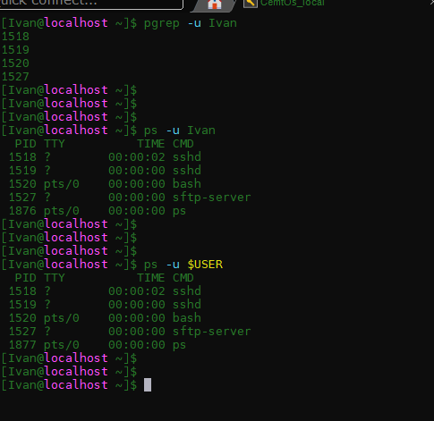

9) Utilities can be used to analyze existing running tasks

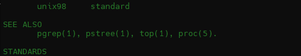

10) The ***top*** program provides a dynamic real-time view of a running system.  It can display system summary information as well as list of processes or threads currently being managed by the Linux kernel.  The types of system summary information shown and the types, order and size of information displayed for processes are all user configurable and that configuration can be made persistent across restarts.

11) Display the processes of the specific user using the top command.

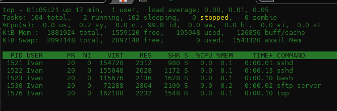

12) We can use different interactive commands can be used to control the top command. For example pressing key:

***h*** - shows to us a hint about interactive commands;
***f*** - we can choose fields, change those order and choose field to sort;
***k*** - we can kill selected proces; ***r*** - we can renice selected proces;
***d*** - we can set update interval.

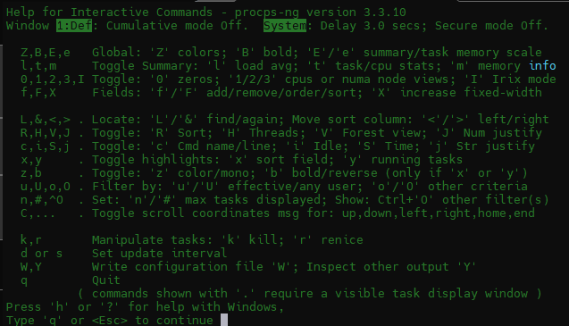
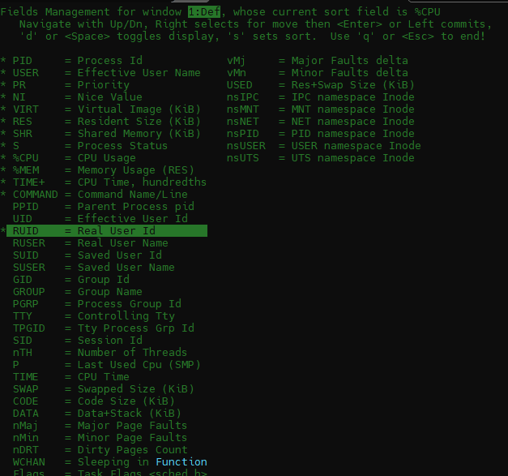
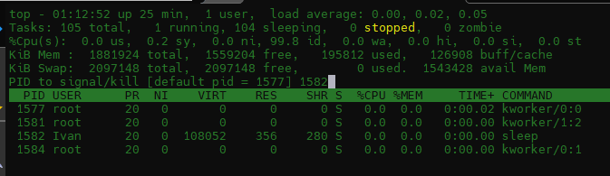
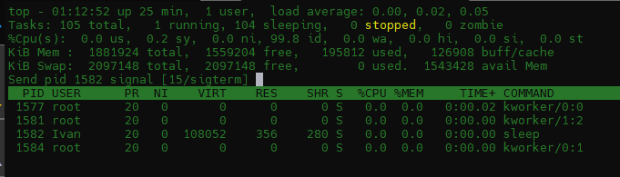

13) Also we can sort the contents of the processes window using hotkeys:

***Shift+m*** - by memory usage;
***Shift+p*** - by CPU usage.

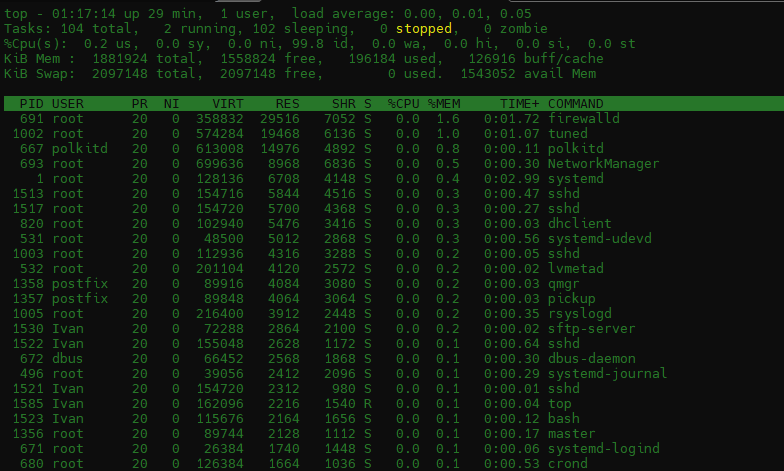
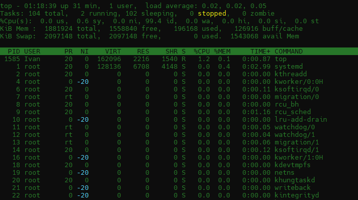

14) The nice and renice commands let us fine-tune how the kernel treats oure processes by adjusting their priorities. We can use the nice command to adjust the nice value for a program as we launch it. This allows us to increase or decrease the priority given to the process by the kernel, relative to the other processes.

      sudo nice --10 ./*programm*
The renice command lets us adjust the nice value of a running process. We don’t need to stop it and relaunch it with nice. We can set a new value on-the-fly.

    sudo renice -n 5 PID

15) We can use the ***top***  interactive command using ***r***-key  to adjust the nice value for a program on-the-fly. 

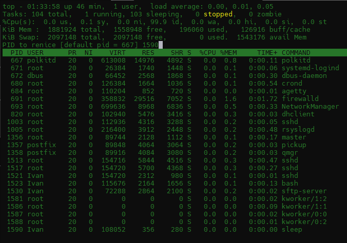

16) I examined the kill command.

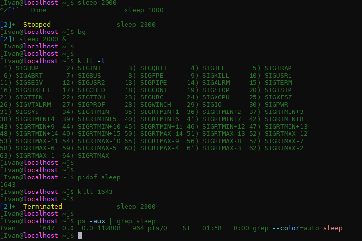

17) The ***jobs*** command will list all jobs on the system; active, stopped, or otherwise. We can use only jobs command or with using such options included:

- l - list PIDs in addition to default info
- n - list only processes that have changed since the last notification
- p - list PIDs only
- r - show only running jobs
- s - show only stopped jobs

The ***bg*** command is used for resume the program in the background and the ***fg*** command is used to move a background program  into the foreground.

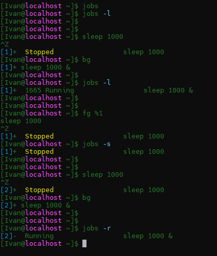

The ***nohup*** command is used to run a process in the background. A process started by this command will continue to run even if the terminal from which it was run is closed.

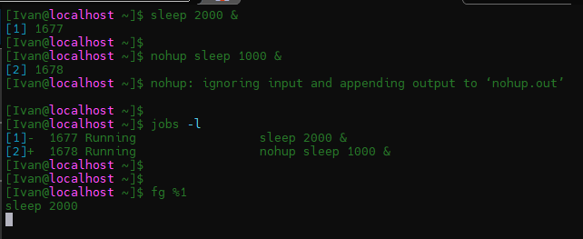
 
### Part2

Check the implementability of the most frequently used OPENSSH commands in the MS Windows operating system. (Description of the expected result of the commands + screenshots: command – result should be presented)
1) I installed the OpenSsh server in Windows 10 (which runs in VirtualBox). With Putty I connected  to virtual machine using Ssh. 

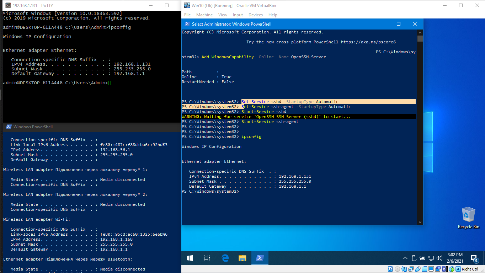

I tried to run some commands such as: cd, ls, pwd, mkdir, but it didn't work.

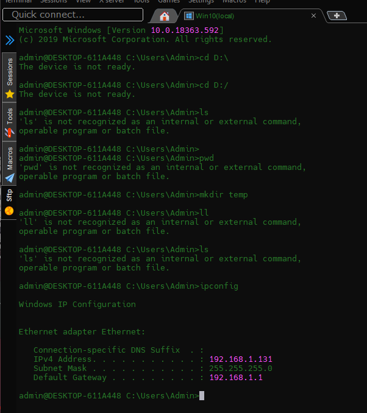

I used the ***scp*** command to copy the keys from the VB machine. And then I wanted to send information from public key to the the CentOs VM using the ***ssh-copy-id*** command, but that command doesn't work on Windows.

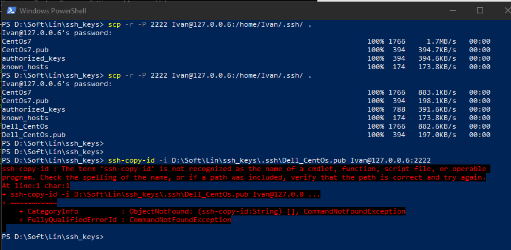

Then I tried the ipconfig command and got the IP address. After that, I switched to PowerShell and tested the same commands. When I ran the ls command, I saw that the ***mkdir*** command was running successfully in ssh, and a temp directory was created.

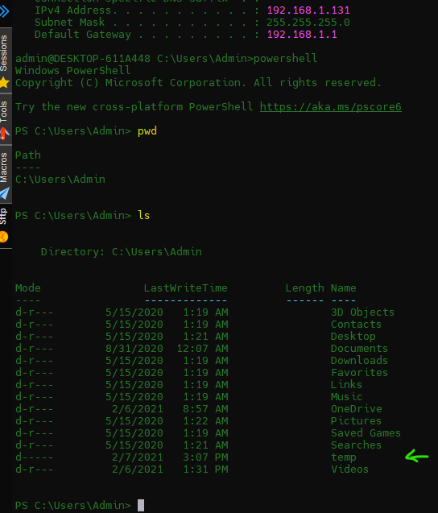

2) I change settings in  ***/etc/ssh/sshd_config*** file.

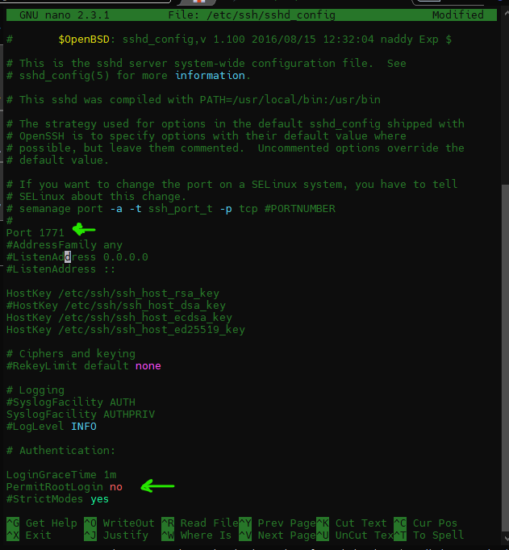
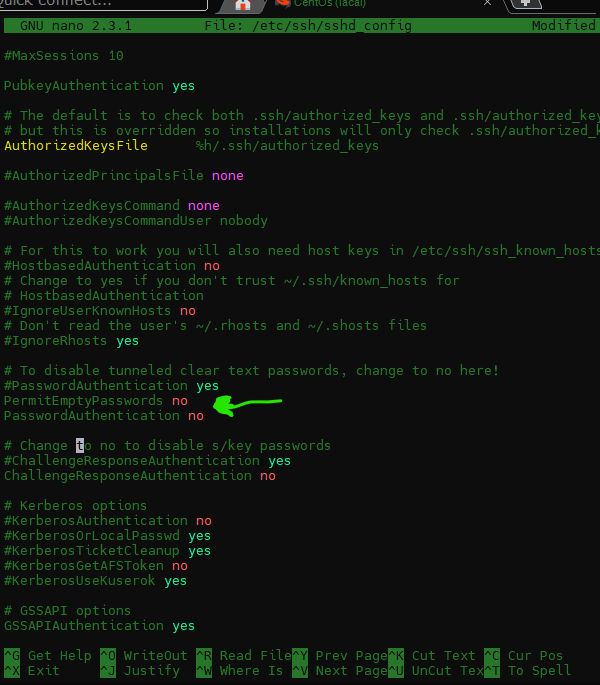

And than I changed configuration with ***semanage port -a -t ssh_port_t -p tcp 1771*** command to enable port.

3) Here's a summary of commonly used options to the keygen tool:

- ***b*** “Bits” This option specifies the number of bits in the key. The regulations that govern the use case for SSH may require a specific key length to be used. In general, 2048 bits is considered to be sufficient for RSA keys.

- ***e*** “Export” This option allows reformatting of existing keys between the OpenSSH key file format and the format documented in RFC 4716, “SSH Public Key File Format”.

- ***p*** “Change the passphrase” This option allows changing the passphrase of a private key file with [-P old_passphrase] and [-N new_passphrase], [-f keyfile].

- ***t*** “Type” This option specifies the type of key to be created. Commonly used values are: - rsa for RSA keys - dsa for DSA keys - ecdsa for elliptic curve DSA keys

- ***i*** "Input" When ssh-keygen is required to access an existing key, this option designates the file.

- ***f*** "File" Specifies name of the file in which to store the created key.

- ***N*** "New" Provides a new passphrase for the key.

- ***P*** "Passphrase" Provides the (old) passphrase when reading a key.

- ***c*** "Comment" Changes the comment for a keyfile.

- ***p*** Change the passphrase of a private key file.

- ***q*** Silence ssh-keygen.

- ***v*** Verbose mode.

- ***l*** "Fingerprint" Print the fingerprint of the specified public key.

- ***B*** "Bubble babble" Shows a "bubble babble" (Tectia format) fingerprint of a keyfile.

- ***F*** Search for a specified hostname in a known_hosts file.

- ***R*** Remove all keys belonging to a hostname from a known_hosts file.

- ***y*** Read a private OpenSSH format file and print an OpenSSH public key to stdout.

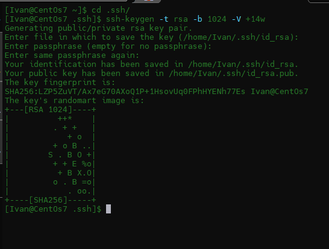

4) Implement port forwarding for the SSH client from the host machine to the guest Linux virtual machine behind NAT.

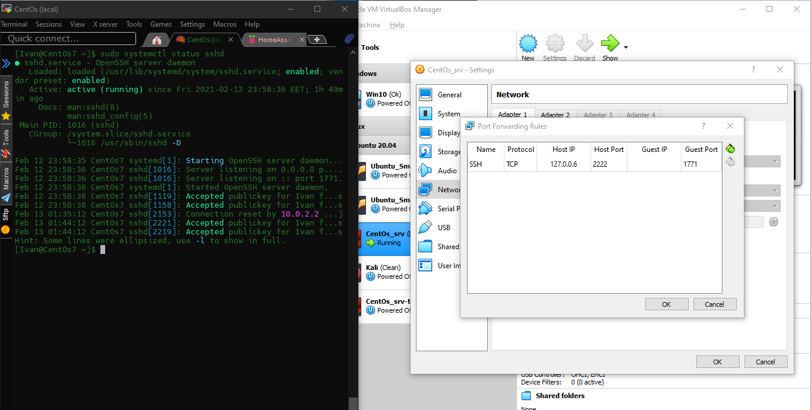

5) 

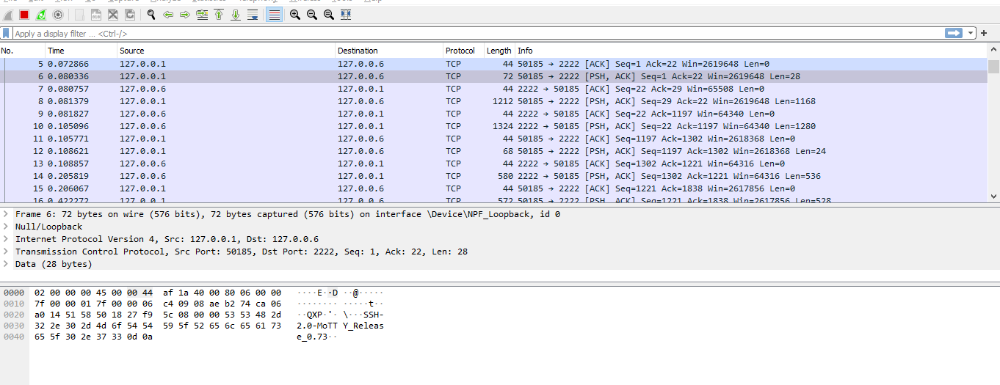
____

#### Thanks!