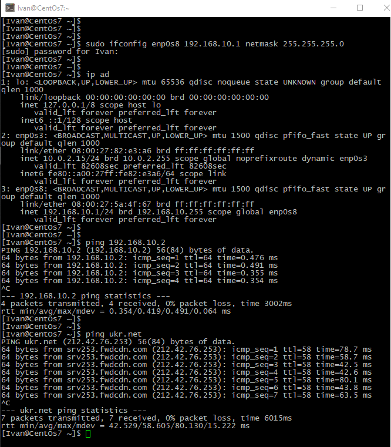
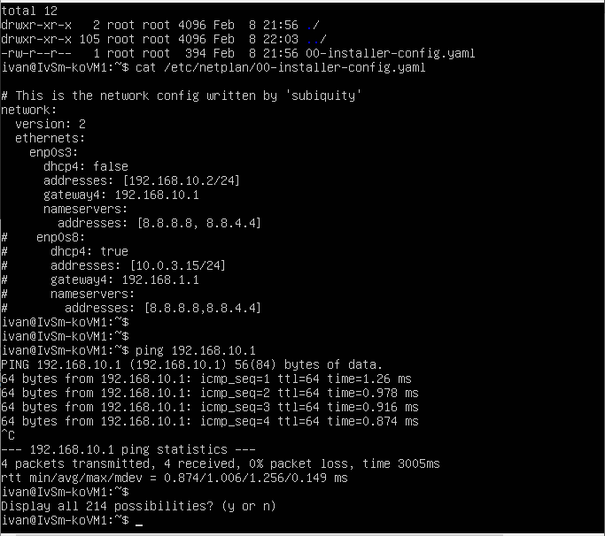
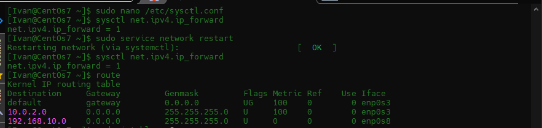
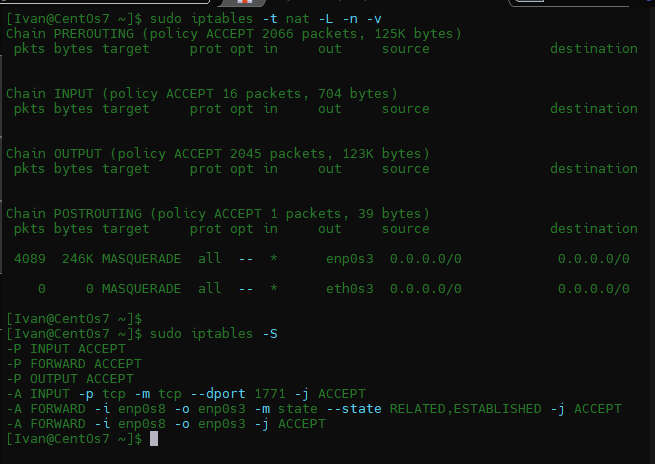
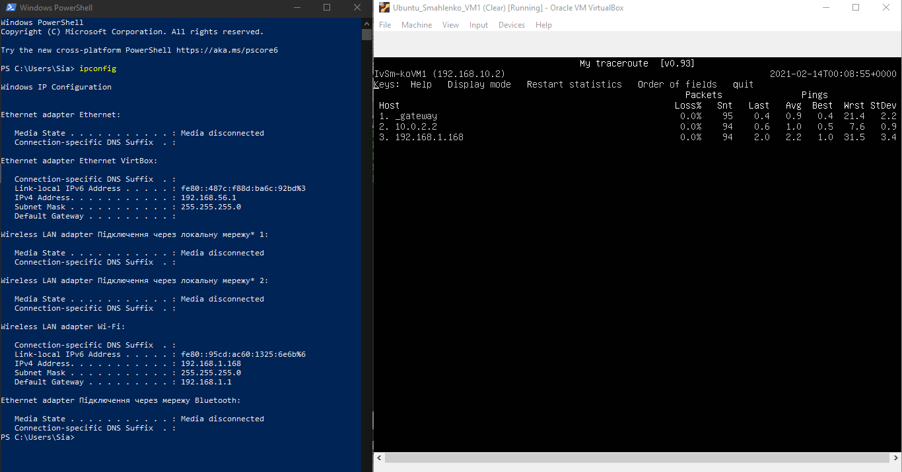
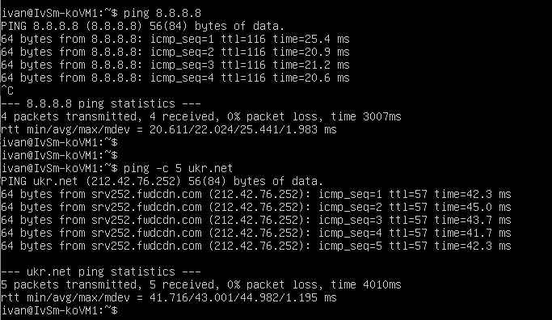
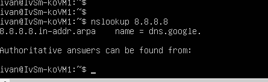
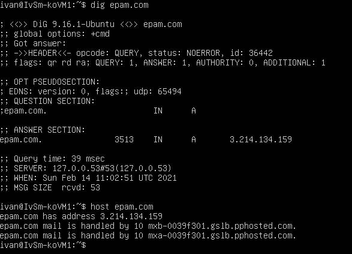
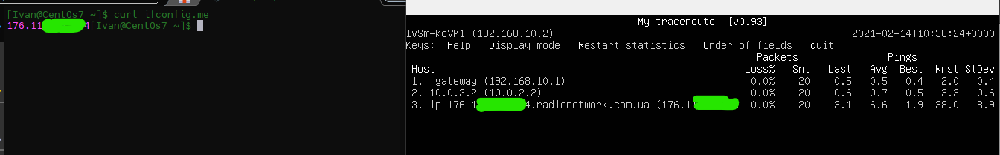
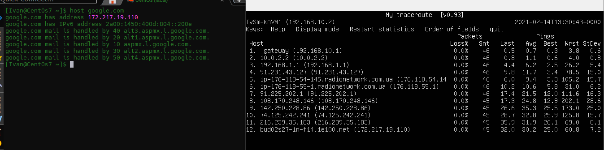

/#### DevOps_online_Lviv_2020Q42021Q1

## TASK 6.1

### Module 6 Networking with Linux.

____

1) Using VirtualBox I modeled connection according to scheme provided in task. I maked setups ethernets controllers in both operating systems.

In CentOs, in addition to the NAT interface (which automatically accepts the IP address), I set the IP address for the internal connection.

Using netplan I set a static IP address In Ubuntu for the internal connection.

2) Next, I enable forwarding in Centos.

After that, I installed and configured iptables and disabled the firewall.

3) Than I checked the route from VM2 to Host.

4) I checked the access to the Internet.

5) I determined which resource has an IP address of 8.8.8.8.

6) I determined which IP address belongs to resource epam.com.

7) I determined the default gateway for my HOST and display routing table.

8) I used the mtr command to track the route to google.com.
  

____

#### Thanks!