/#### DevOps_online_Lviv_2020Q42021Q1

## TASK 8.1

### Continuous integration / Continuous delivery (deployment).

____

In this part of the training, I started working with ***Jenkins***. Jenkins is a stand-alone open automation server that can be used to automate a variety of tasks related to creating, testing, and delivering or deploying software.
Jenkins can be installed through its own system packages, Docker, or even run standalone on any machine with a Java runtime (JRE) installed. I installed it on a CentOs virtual machine. 

I repeated the examples from our lecture.

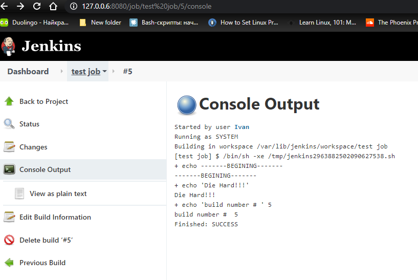

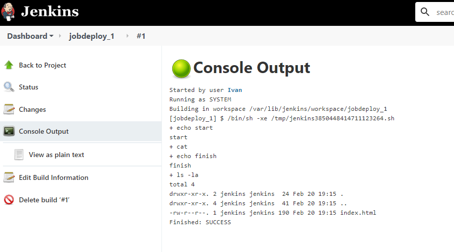

On another VM with Ubuntu I Installed ***Apache*** HTTP Server -- the world's most popular Web server software.

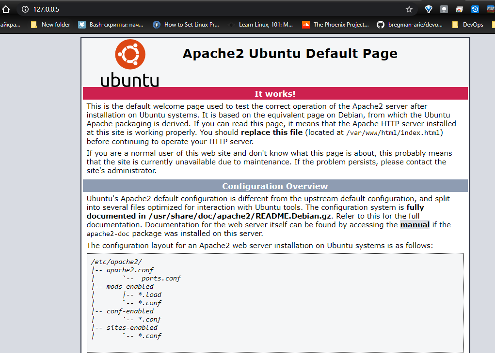

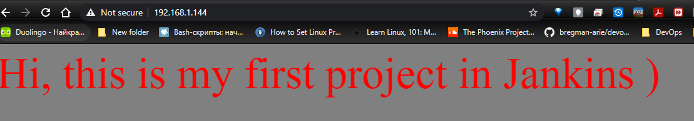

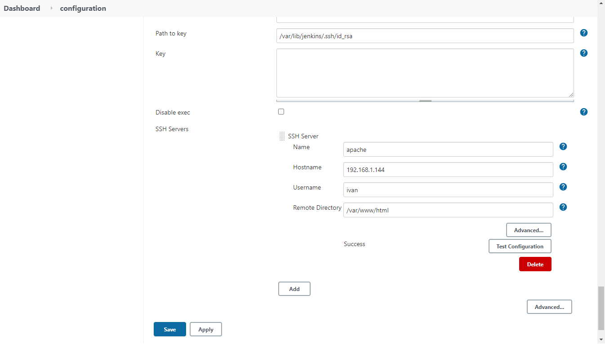

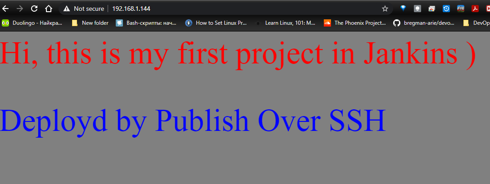

After that I worked on ***Git*** and ***GitHub***

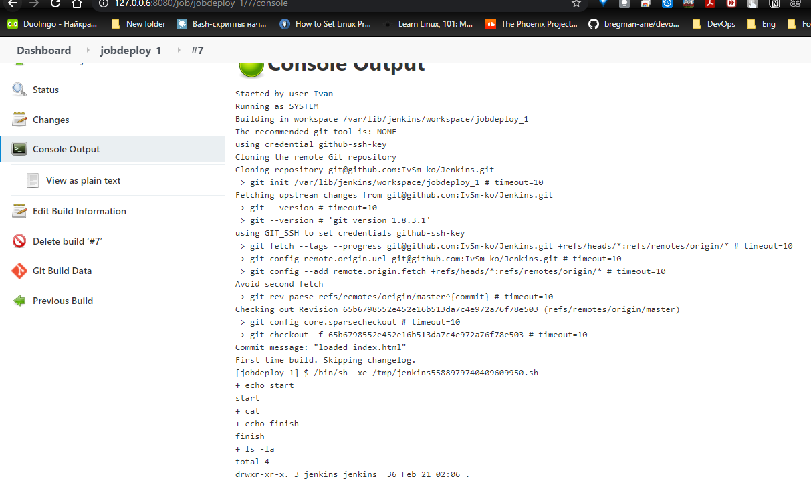

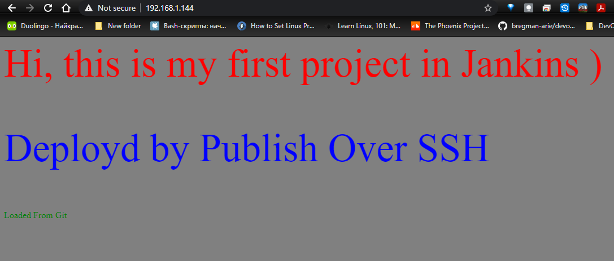

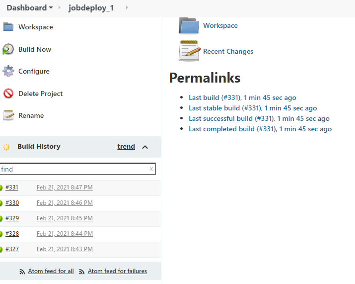

Then I configured the ***node*** (on VM Ubuntu) for Jenkins.

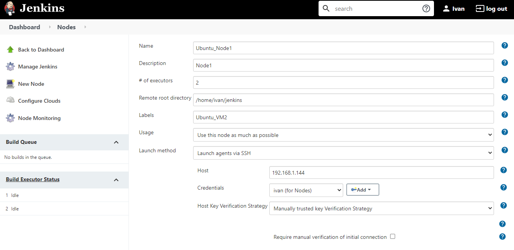

I installed another copy of Apache in Docker on my Raspberry PI. And set up automation, when I push something to GitHub, it will be dragged using Node and published on the Raspberry.

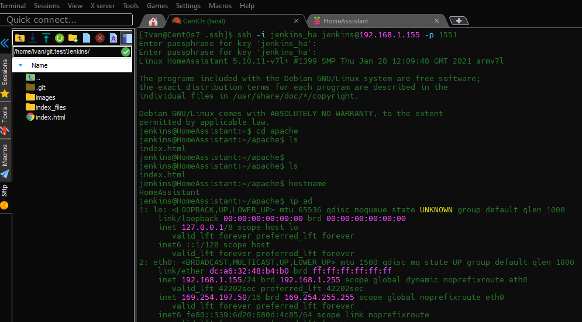

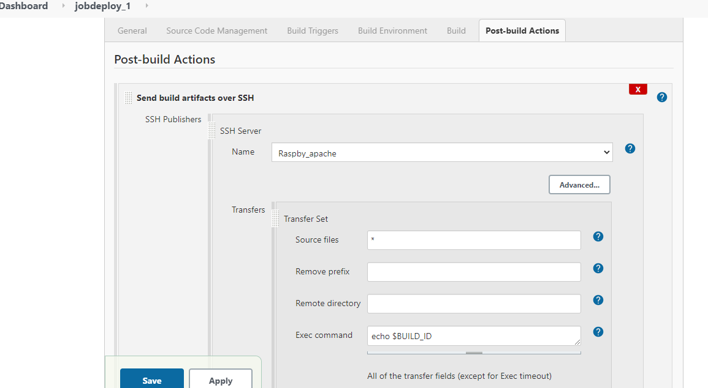

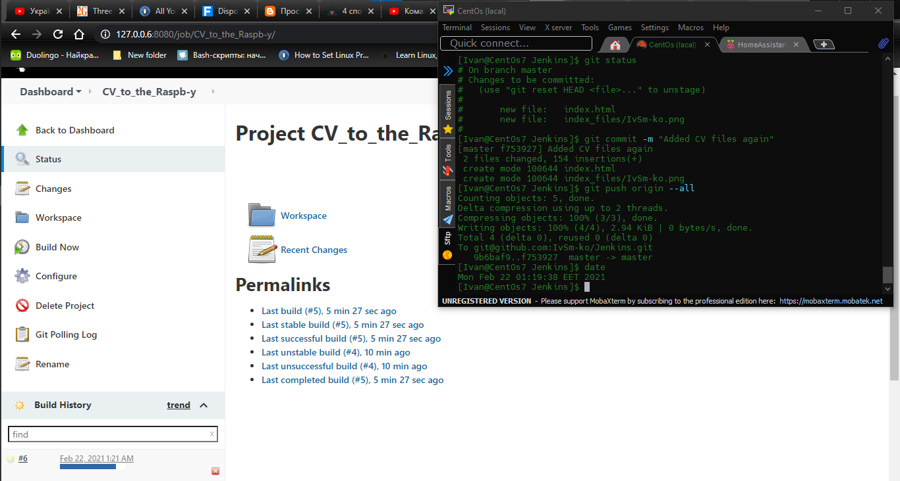

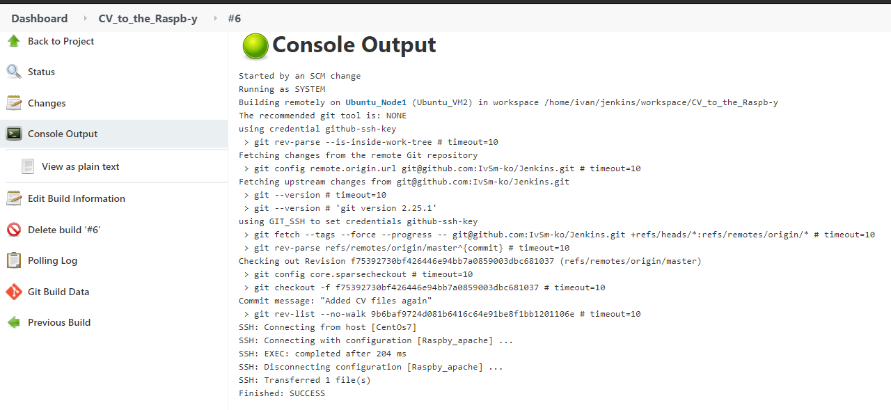

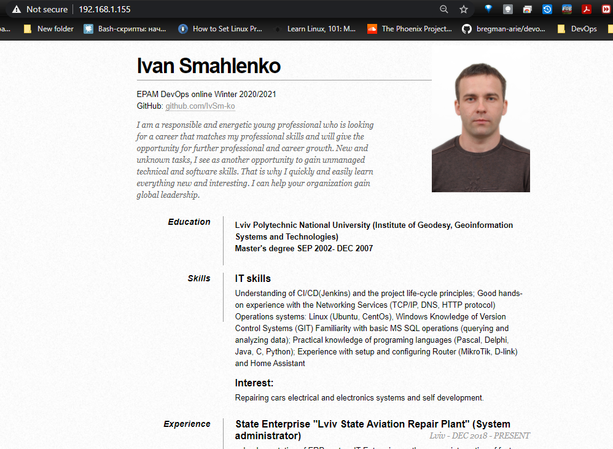

____

#### Thanks!