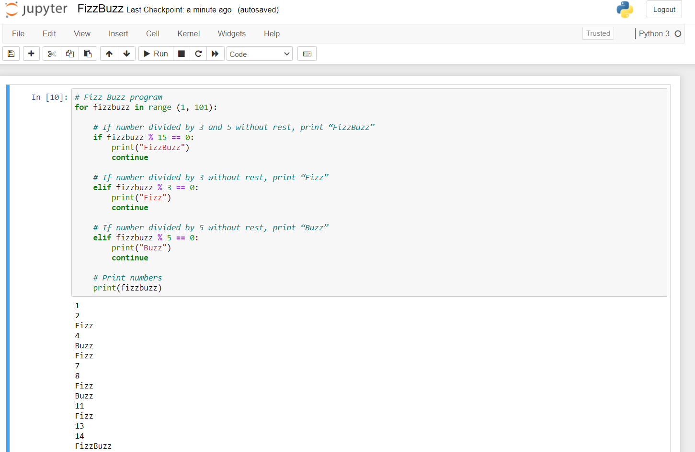
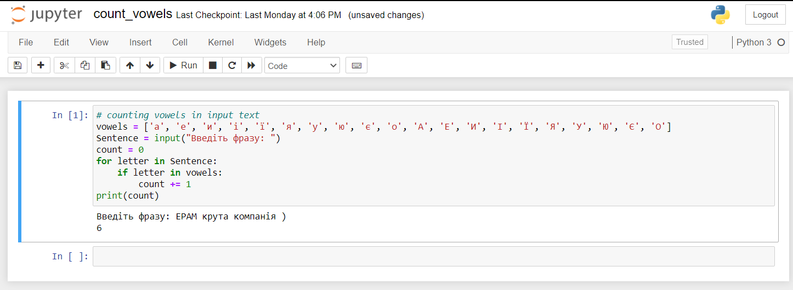
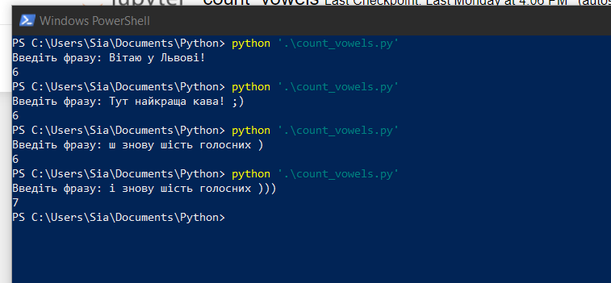

/#### DevOps_online_Lviv_2020Q42021Q1

## TASK 9.1

### Python Essentials.

____

In this task I created a simple FizzBuzz  program.

Then I created a simple count_vowels  program for counting vowel letters in phrase.

____

#### Thanks!