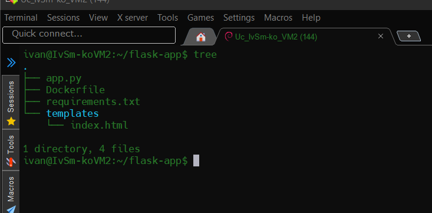
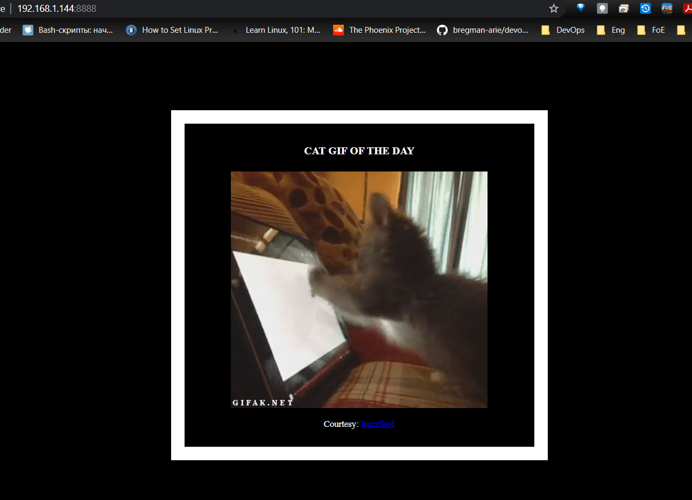
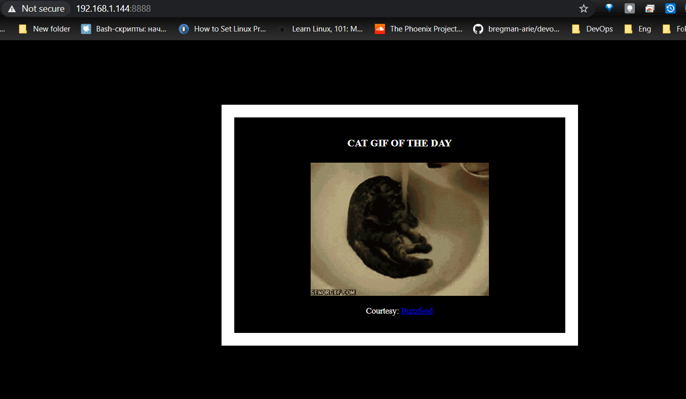
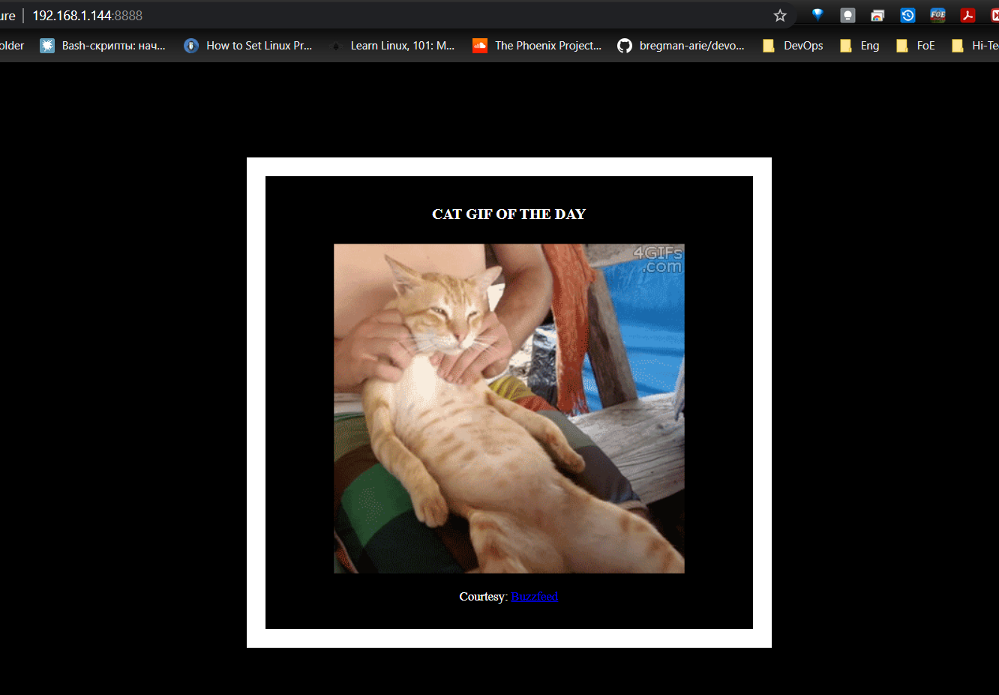
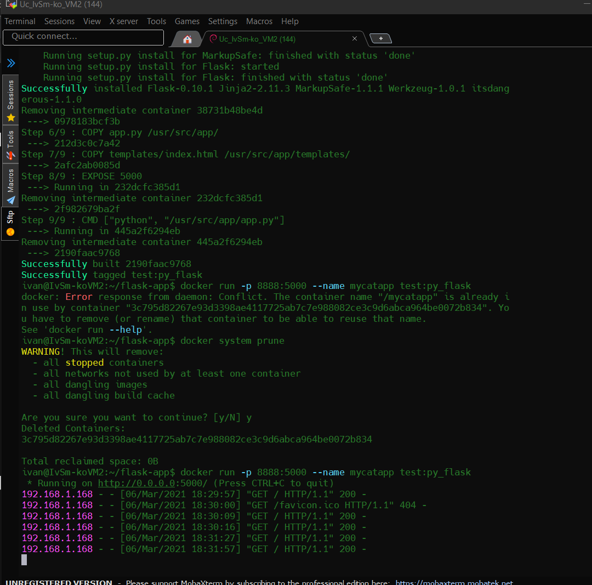

##### DevOps_online_Lviv_2020Q42021Q1
# TASK 9.3

### Containerization.Docker.

I created such files according to lecture №2. 

To display images of cats, I replaced the links to images of cats in app.py. We can see a new image of a cat when I refresh the page in the browser

#### Thanks!

